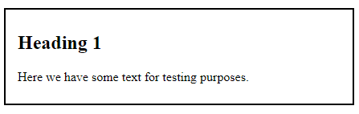

# Box Model

Kaikki HTML-elementit ovat periaatteessa laatikoita, useimmiten suorakulmioita. Näin on myös CSS:ssä, jossa näillä suorakulmioilla on eri tasoja. Puhutaan usein box modelista.

Yksittäisen elementin mallin näkee selkeästi kehittäjätyökaluista Elements-välilehdeltä. Se kertoo, mikä on elementin koko, paljonko sillä on täytetilaa, paljonko reunusta ja paljonko marginaalia.


## Padding

Padding on täytetila, joka tulee elementin sisällön (yleensä tekstin) ja elementin reunan väliin. Sitä voi säätää erikseen ylös (padding-top), alas (padding-bottom), oikealle (padding-right) ja vasemmalle (padding-left) tai suoraan yhdessä tai ylä- ja alasuunta sekä sivut yhdessä. Jos samalla lausekkeella haluaa säätää kaikille eri arvot, ne menevät järjestyksessä top, right, bottom, left. 

Alla olevalla koodilla säädetään sivut ja ylä- ja alasuunta erikseen, ensin ylä- ja ala, sitten oikea ja vasen, jolloin ylös ja alas tulee 8 pikselin padding ja oikealle ja vasemmalle 15 pikselin padding.

````css
.mydiv {
    padding: 8px 15px;
}
``````

## Border
Elementille voi antaa reunukset. Reunuksille voi antaa värin (border-color), paksuuden (border-width) ja kuviotyylin (border-style). Ne voi antaa erikseen tai yhdistelmällä. On mahdollista määritellä reunus vain johonkin yksittäiseen suuntaan (esim. boder-left).

[w3schools](https://www.w3schools.com/css/css_border.asp)<base target="_blank"> esittelee eri reunustyylivaihtoehdot.

Reunukset on mahdollista kirjoittaa suoraan yhdellä rivillä, kun sille antaa ensin paksuuden, sitten tyylin ja lopuksi värin. Jos elementillä on padding, se tulee tekstin ja reunuksen väliin.

````css
.mydiv {
    padding: 8px 15px;
    border: 2px solid black;
}
````
Lopputulos kapealla näytöllä on tämä:



## Margin

## Margin Collapse

# Height ja Width

## Width

## Height

# Border-box

# Display