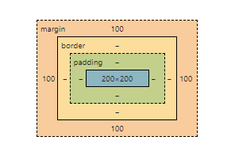

# Box Model

Kaikki HTML-elementit ovat periaatteessa laatikoita, useimmiten suorakulmioita. Näin on myös CSS:ssä, jossa näillä suorakulmioilla on eri tasoja. Puhutaan usein box modelista.

Yksittäisen elementin mallin näkee selkeästi kehittäjätyökaluista Elements-välilehdeltä. Se kertoo, mikä on elementin koko, paljonko sillä on täytetilaa, paljonko reunusta ja paljonko marginaalia.



## Padding

Padding on täytetila, joka tulee elementin sisällön (yleensä tekstin) ja elementin reunan väliin. Sitä voi säätää erikseen ylös (padding-top), alas (padding-bottom), oikealle (padding-right) ja vasemmalle (padding-left) tai suoraan yhdessä tai ylä- ja alasuunta sekä sivut yhdessä.

## Border
Elementille voi antaa reunukset. Reunuksille voi antaa värin, paksuuden ja kuviotyypin. Ne voi antaa erikseen tai yhdistelmällä. On mahdollista määritellä reunus vain johonkin yksittäiseen suuntaan.

[w3schools](https://www.w3schools.com/css/css_border.asp)<base target="_blank"> esittelee eri reunusvaihtoehdot.

Reunukset on mahdollista kirjoittaa suoraan yhdellä rivillä, kun sille antaa ensin paksuuden, sitten tyylin ja lopuksi värin.

````css
.mydiv {
    border: 2px, solid, black;
}
````

## Margin

## Margin Collapse

# Height ja Width

## Width

## Height

# Border-box

# Display