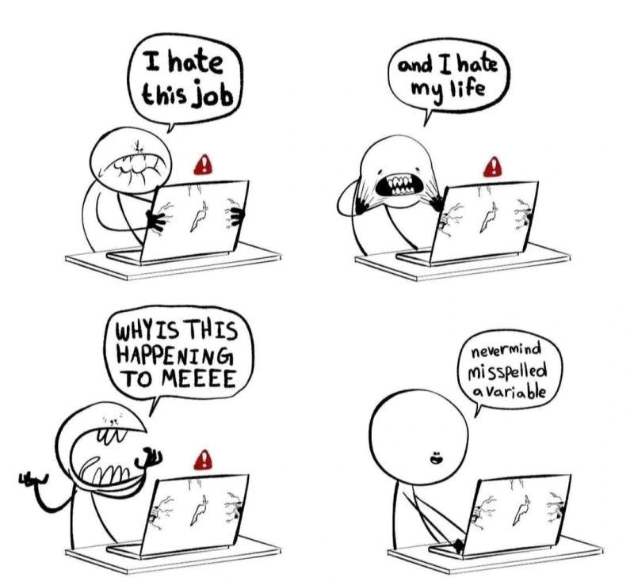

# Harjoitus 4

## Animaatioita ja kuvaefektejä

Harjoitellaan CSS:ää vielä. [Linkin takana](https://preview.themeforest.net/item/maido-multipurpose-ghost-blog-theme/full_screen_preview/24837109?_ga=2.259990478.570486835.1654146705-2133876429.1654146705)<base target="_blank"> on verkkosivu, jolla on käytetty paljon erilaisia CSS-temppuja, mukaan lukien erilaisia animaatioita (voitte valita vaalean tai tumman teeman). Tarkoitus on kopioida sivusto mahdollisimman hyvin.

1. Aloita luomalla sivuston rakenne HTML:llä uuteen tiedostoon. Voit valita kuviksi joitakin soveltuvia kuvia esim Pixabaysta.
2. Tee ensin sivuston asettelu. Huomio myös esimerkiksi paikalleen jäävä header (toimii position-ominaisuudella).
3. Lisää kuviin väriefektit.
4. Lisää viimeisenä animaatioita.

Vähimmäisvaatimukset:
- header-osio, jossa on otsikko, navigaatiopalkki ja hakuikoni (ikonista ei tarvitse tapahtua mitään). Hover-efektiksi joko pallo tai alleviivaus.
- Teksti pystysuunnassa vasemmassa reunassa
- Ylin kuvaryhmä eli yksi suurempi ja neljä pienempää kuvaa, joiden päällä on tekstiä ja osassa on väriefekti ja kaikissa hover-efekti
- Suuri kuva, jonka päällä on tekstiä ja jossa on hover-efekti
- Leveä nappi, jossa on hover-efekti

Kevennykseksi

