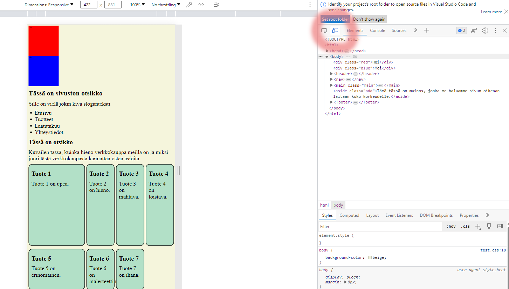

# Responsiivisuus

Verkkosivujen täytyy toimia ja näyttää hyviltä niin leveällä kuin kapeallakin näytöllä. Olemme keskittyneet ennen kaikkea tietokonenäytöllä toimivaan asetteluun, koska työskentelemme tietokoneilla, mutta verkkosivuja saatetaan käydä katsomassa myös tablettikokoisilla eli pienemmillä mutta edelleen vaakatasoisilla laitteilla tai sitten kännyköillä, jotka ovat pystysuunnassa ja kapeita. Puhutaan responsitiivisuudesta eli siitä, että sivusto reagoi leveyteen.

## Mobile first

Nykyään puhutaan sivustojen suunnittelussa siitä, että ne suunnitellaan *mobile first* -periaatteella eli suunnittelussa tehdään ensin mobiiliversio ja siitä laajennetaan desktop-versioon. Mobiiliversiossa on vähemmän rinnakkain olevia osioita ja usein taustasta voi puuttua kuvia tai versiosta puuttuu kuvituskuvia (*display: none;*), koska tilaa on vähemmän ja on hyvä keskittyä olennaiseen.

Jotta mobiililaitteen selain tietää, että sivusto on suunniteltu responsiiviseksi, HTML-tiedoston *head*-tagiin pitää lisätä tieto siitä (meta-tag):

```html
<head>
    <meta name="viewport" content="width=device-width, initial-scale=1, maximum-scale=1">
    <link type="text/css" rel="stylesheet" href="myPage.css" >
</head>
```

Jos teette uuden HTML-tiedoston laittamalla VisualStudio Coden generoimaan sivun rungon, VisualStudio Code lisää tagin automaattisesti.

## Flex ja grid

Molempia asettelutapoja voidaan käyttää auttamaan sivua toimimaan responsiivisesti, sillä molemmissa usein elementit kasvavat kokoa ruudun koon mukaan. Lisäksi esimerkiksi *flex-wrap* auttaa siirtämään elementtejä uudelle riville, jos vaakasuunnassa ei ole riittävästi tilaa. 

## Mitat

Sivuston asettelun lisäksi on syytä tarkistaa sivulla käytetyt mitat kuten fonttien koko, *margin* ja *padding* asetukset jne. 

- Prosentit (%): Käytetään määrittämään elementin koko suhteessa sen vanhemman (parent) elementin kokoon. Parent-elementti voi olla koko ruudun kokoinen, mutta se voi olla myös pienempi. 

- vh (viewport height) ja vw (viewport width): Suhteuttavat elementin koon koko selaimen näkymän korkeuteen (vh) tai leveyteen (vw). Esimerkiksi 100vw täyttää koko näytön leveyden.

- rem: Yksikkö, joka perustuu juurielementin (html) fonttikokoon, joka yleensä on 16px. Esimerkiksi 2rem tarkoittaa kaksi kertaa juurielementin fonttikokoa.

- em: Yksikkö, joka perustuu elementin vanhempi-elementin kokoon. Esimerkiksi jos ``<div>`` -elementille on määritelty fonttikoko 20 pikseliä, 2em tarkoittaisi 40 pikseliä.

Esimerkissä määritellään, että perusfontti on 12 pikseliä ja yhdessä divissä se on puolitoistakertainen.

```css
html {
    font-size: 12px;
}

.myDiv {
    font-size: 1.5rem;
    padding: 0.25rem;
    margin: 0.5rem;
}
```

## Kuvat

*img*-tagille voidaan antaa vaihtoehtoiset kuvat käytettäväksi tietyn kokoisilla näytöillä.

````html

````

Tässä siis *srcset* sisältää kaikki kuvat ja sen, kuinka suurilla näytöillä sitä käytetään. *sizes* sisältää sen, kuinka suuria kuvat ovat. Pilkulla erotetaan eri kuvat.

## Media query

Media queryt ovat pääasiallinen tapa, millä voimme kirjoittaa CSS-koodiin sääntöjä eri leveyksistä. Media queryssä määritellään näytön leveyden perusteella raja, milloin jokin sääntö pätee ja milloin ei. 

Esimerkissä ylempi sääntö pätee kaikkiin laitteisiin, joiden leveys on 601 pikseliä tai enemmän (min-width). Silloin käytössä on *grid*-asettelu. Myös fonttikoko on suurempi ja taustaväri erilainen. Alemmassa esimerkissä ruutu on 600 pikseliä tai pienempi (max-width) ja asettelu on silloin *flex*, taustaväri eri ja fontti pienempi.

```css
@media screen and (min-width: 601px){
  body {
    display: grid;
    grid-template-areas:
      'header header header header header header'
      'aside nav nav nav nav nav'
      'aside article article article section section'
      'footer footer footer footer footer footer';
    grid-gap: 10px;
    background-color: peru;
    padding: 10px;
    font-size: 16px;
  }
}

@media screen and (max-width: 600px){
  body {
    display: flex;
    flex-direction: column;
    background-color: #3196F3;
    padding: 3px;
    font-size: 10px;
    }

  aside {
    display: none;
  }
}
```

Lisäksi kuvista kannattaa olla omat versiot suurille ja pienille kuville, sillä suuren kuvan lataaminen vie enemmän aikaa kuin pienen. Se voi olla sama kuva pienennettynä, mutta joissakin tilanteissa se voi olla esimerkiksi osa alkuperäisestä kuvasta, jos olennaisin asia kuvasta ei liian pienenä enää näy.

Isolla ruudulla voimme käyttää esimerkiksi tätä kuvaa: 


Pienellä ruudulla taas voi olla järkevämpää valita kuvasta vain tärkein eli linna:

 

### Testaaminen

 Selaimen kehittäjätyökaluissa on mahdollisuus valita mobiilinäkymä sekä säätää selaimen leveyttä siinä näkymässä.

 

### Lisätietoa

- Tutustu @media-säännön käyttöön [@media w3school](https://www.w3schools.com/cssref/css3_pr_mediaquery.asp)
- Video @media-säännön käytöstä  
[HTML5 and CSS3 Responsive design with media queries](https://www.youtube.com/watch?v=fA1NW-T1QXc)

### Demotehtävä

1. Luo uusi HTML-tiedosto.
2. Lataa Teamsin kansiosta kolme kuvaa, joissa lukee *noble-castle*. 
3. Aseta kuvat taustakuvaksi ``<header>``iin niin, että leveällä näytöllä käytetään leveää kuvaa ja kapealla kapeaa kuvaa. Kirjoita sen päälle jokin otsikko.
4. Lisää kuvan alle navigointipalkki, jossa on vähintään neljä kuvitteellista linkkiä. Asettele se niin, että leveällä näytöllä linkit ovat vierekkäin ja kapealla näytöllä ne ovat allekkain. Helpointa tämä on käyttämällä flexistä ensin flex-direction: row; ja sitten flex-direction: column;