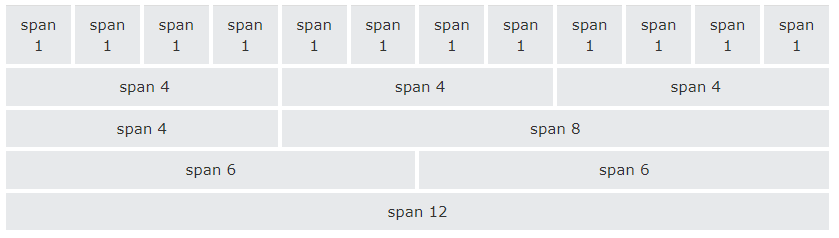

# Bootstrap

Bootstrap on muotoilukirjasto, jolla voi osin tai täysin korvata CSS:n käytön HTML:n muotoilussa. Siinä on myös sisään rakennettuja toiminnallisuuksia, joilla voi osin korvata JavaScriptiä. Kun sitä osaa käyttää, on mahdollista luoda siistin näköisiä sivuja nopeammin. Toisaalta yhtä aikaa menettää hieman vapautta tehdä omannäköistä tyyliä. Bootstrapin merkittävin hyöty on siinä, että sitä käyttämällä suurin osa elementeistä on helposti responsiivisia eli ne skaalautuvat näytön leveyden mukaan, kun niitä käytetään oikein. Bootstrapin muotoilut yhdistetään elementin luokkaan eli *class*iin.

Opettelemme käyttämän versiota 5, joka on julkaistu vuonna 2021, mutta on pieni mahdollisuus, että jokainen ominaisuus ei toimi jokaisella selaimella (esimerkiksi vanhalla Internet Explorerilla). Emme käy läpi kaikkia Bootstrapin mahdollisuuksia, vaan tutustumme siihen sen verran, että ymmärrätte perusperiaatteet ja voitte etsiä siitä lisää hyödyllisiä ominaisuuksia. 

## Bootstrapin ottaminen käyttöön

Jotta sitä voidaan käyttää, täytyy HTML-tiedostoon linkittää joitakin asioita. Sen voi tehdä muutamalla eri tavalla, mutta tässä suosittelen lisäämään Bootstrapin linkkinä ja scriptinä headiin. Ne voi kopioida alla olevasta koodista ja lisätä oikeaan kohtaan omaa koodia.

````html
<!doctype html>
<html lang="en">
  <head>
    <meta charset="utf-8">
    <meta name="viewport" content="width=device-width, initial-scale=1">
    <title>Bootstrap demo</title>
    <!-- Latest compiled and minified CSS -->
    <link href="https://cdn.jsdelivr.net/npm/bootstrap@5.3.3/dist/css/bootstrap.min.css" rel="stylesheet">

    <!-- Latest compiled JavaScript -->
    <script src="https://cdn.jsdelivr.net/npm/bootstrap@5.3.3/dist/js/bootstrap.bundle.min.js"></script>
  </head>
  <body>
    <h1>Hello, world!</h1>
  </body>
</html>
````

## Bootstrapin ominaisuuksia

Useimmat elementit on kannattavaa laittaa luokan *container* sisään. Se antaa niille järkevät marginaalit useimmissa tapauksissa. *container-fluid* puolestaan on koko selaimen levyinen elementti.

````html
<div class="container">
  <h1>My First Bootstrap Page</h1>
  <p>This is some text.</p>
</div>
````

### Grid

CSS:ssä on asettelussa mahdollista käyttää *grid*iä tai muita asettelumenetelmiä, mutta Bootstrapissa se on ensisijainen asettelutyökalu. Bootstrapin gridissä on kaksitoista pystyriviä, joista on mahdollista jakaa tilaa elementeille. Alla olevassa kuvassa on demonstroitu, miten sivun voi jakaa joko tasakokoisiin tai vaihtuvakokoisiin paloihin.



Lisäksi Bootstrapissa on määritelty *grid-luokat* näytön leveyden perusteella. 
- col- (puhelimille, alle 576 pikseliä)
- col-sm- (isoille puhelimille ja tableteille, yli 576 pikseliä)
- col-md- (isoille tableteille, yli 768 pikseliä)
- col-lg- (kannettaville tietokoneille, yli 992 pikseliä)
- col-xl- (suurille tietokoneruuduille ja muille näytöille, yli 1200 pikseliä)

Jotta pääsemme käyttämään Bootsrapin gridiä, ensin meidän pitää määritellä rivi eli *row* -elementti, joka pitää sisällään kaikki ne elementit, jotka haluamme gridiin. Kun pystyrivien numeroiden määrä lasketaan yhteen, lopputulokseksi pitää saada 12. Alla esimerkissä kaksi ensimmäistä elementtiä on kapeampia (25%) ja kolmas leveämpi (50%). Ne olisi myös mahdollista kaikki saada yhtä suuriksi antamalla jokaisen arvoksi 4. Sitten pitää määritellä, mikä on suurin näyttö, millä tämä toimii eli pienemmällä näytöllä tämä sääntö ei enää päde, vaan elementit menevät allekkain. Tässä esimerkissä elementit menevät allekkain, kun mennään tabletin kokoluokkaan.

````html
<div class="row">
  <div class="col-md-3"><p>Here is the first part</p></div>
  <div class="col-md-3"><p>Here is the second part</p></div>
  <div class="col-md-6"><p>Here is the third part which is wider than the first two</p></div>
</div>
````


## Demotehtävä 1

1. Luo uusi HTML-sivu, jolle linkkaat tarvittavan Bootstrapin (voit kopioida ylempänä olevan pohjan).
2. Luo sivulle neljä elementtiä, joihin kirjoitat jotain tekstiä.
3. Asettele nämä elementit niin, että leveällä ruudulla kolmas elementti vie tilaa yhtä paljon kuin kolme muuta yhteensä, ja kapealla ruudulla ne asettuvat allekkain.
4. Laita kaikki elementit luokan *container* sisään ja katso, millainen ero asettelussa on.

### Tekstinkäsittely

Yksittäiselle elementille voidaan antaa monta eri luokkaa, jolloin ne erotetaan välilyönnillä.

Tekstiä voidaan muotoilla monilla tavoilla Bootstrapilla. Kaikkia eri tapoja on listattu [täällä](https://www.w3schools.com/bootstrap5/bootstrap_typography.php)<base target="_blank">. 

Esimerkiksi tekstin taustan värin voi säätää sen merkityksen mukaan eli esimerkiksi onnistumisella on vihreä tausta, varoituksella keltainen ja vaaralla tai virheellä punainen. Nämä onnistuvat nopeasti antamalla tekstille luokan *bg-success*, *bg-warning* tai *bg-danger*.

## Demotehtävä 2

1. Käytä aiempaa demotehtävää pohjana. Katso linkin takaa ohjeita.
2. Muuta ensimmäistä tekstielementtiä niin, että se on kokonaan kirjoitettu isoilla kirjaimilla.
3. Muuta toista tekstielementtiä niin, että se on kirjoitettu pienellä tekstillä.
4. Muuta kolmatta tekstielementtiä niin, että se on "onnistumisteksti" eli vihreällä kirjoitettu.
5. Muuta neljättä tekstielementtiä niin, että se on muotoiltu koodiksi.

### Kuvat

Kuvia voi nopeasti käsitellä Bootstrapilla eli niille voi lisätä pyöristetyt kulmat (*rounded*), niistä voi tehdä täysin pyöristetyt (*rounded-circle*) tai niille voi antaa kehykset (*img-thumbnail*). ([Lisää kuvista w3schoolsissa](https://www.w3schools.com/bootstrap5/bootstrap_images.php)<base target="_blank">).

Kuvista ja teksteistä voi tehäd myös kortteja (kuvia kuvatekstillä). Lue lisää [w3schoolsista](https://www.w3schools.com/bootstrap5/bootstrap_cards.php)<base target="_blank">.

### Taulukot

Taulukoille on monia muotoiluvaihtoehtoja Bootstrapissa. Perustaulukon saa, kun antaa ``<table>`` -elementille luokan *table*. Jos haluaa joka toisen rivin vähän tummemmaksi, luokka voi olla *table-striped*. Luokkia on muutama muukin. 

Myös yksittäisiä taulukon rivejä voi muotoilla samoilla väreillä kuin tekstiä tai tekstin taustaa eli *success* on vihreä, *danger* on punainen, *warning* on keltainen ja *info* on sininen. 

Lisää taulukoista voi lukea [täältä](https://www.w3schools.com/bootstrap5/bootstrap_tables.php)<base target="_blank">

## Demotehtävä 3

1. Lisätkää aikaisemmalle sivulle jokin kuva, jolle annat kehykset ja kuvatekstin Bootstrapilla (ks. esimerkkilinkki kuvagalleriasta ylempänä).
2. Lisää sivulle pieni taulukko, johon on kerätty vähintään neljä hedelmää, niiden ostopaikka ja niiden kilohinta (saat keksiä itse). Valitse taulukolle Bootstrap-luokka, joita voit katsoa lisää yllä olevan linkin takaa.
3. Väritä taulukon kalleimman tuoterivin tausta punaisella ja taulukon edullisimman tuoterivin tausta vihreällä käyttämällä Bootstrapia.

### Napit

Bootstrap tarjoaa joukon valmiita nappityylejä erilaisiin tilanteisiin. Ne eroavat väriltään ja niissä on valmiit hover-efektit. Ensin jokaisessa pitää olla luokka *btn*, minkä jälkeen sen ominaisuuksia voi tarkentaa. Napit voivat olla joko taustavärillisiä tai vain reunoiltaan väritettyjä.

[Bootstrapin napit](https://www.w3schools.com/bootstrap5/bootstrap_buttons.php)<base target="_blank">

Lisäksi napin kokoa voi säätää antamalla vielä uuden luokan eli suurentaa *btn-lg*:llä tai pienentää *btn-sm*:llä.

Jos taas haluaa täysleveän napin, luokka on *btn-block*.

### Navigaatio

Bootstrapilla saa tehtyä myös navigaatiopalkkeja. Perusmuotoinen navigaatiopalkki syntyy, kun ``<nav>`` -elementtiin lisää luokan *navbar*. Jos siitä haluaa responsiivisen, siihen voi lisätä osat *-expand-md* (tai *lg* tai *sm* riippuen, missä kohtaa haluaa palkin osat vaakariviksi). Muuten palkki on pystyrivinä.

Linkit voi asettaa keskelle käyttämällä luokkaa *justify-content-center* tai oikealle luokalla *justify-content-end*.

Navigaation väriä voi vaihtaa käyttämällä teksteistä ja napeista tuttuja väriluokkia, esim *bg-success* luo vihreän taustan. 

Navigaation voi tehdä myös hampurilaismallisen pienennyksen tai alasvetovalikon.

Lisää navigointipalkin malleista löytyy [täältä](https://www.w3schools.com/bootstrap5/bootstrap_navs.php)<base target="_blank"> sekä [täältä](https://www.w3schools.com/bootstrap5/bootstrap_navbar.php)<base target="_blank">.

### Lomakkeet

Lomakkeita voidaan muotoilla Bootstrapilla. Jos ``<label>`` ja sen vastaava ``<input>`` laitetaan elementtiin, jonka luokka on *form-group*, luo Bootstrap niille oman muotoilun.

Lisää lomakkeista voi lukea [täältä](https://www.w3schools.com/bootstrap5/bootstrap_forms.php)<base target="_blank">.

## Demotehtävä 4

1. Lisää sivullesi navigointipalkki, jossa on vähintään neljä linkkiä. Tee siitä responsiivinen. Testaa joko hampurilaismallia tai lisää siihen yksi pudotusvalikko. Muotoile se Bootstrapilla.
2. Lisää testisivullesi lomake ja muotoile se Bootstrapilla.
3. Lisää lomakkeeseen kolme nappia, joista yksi on peruutus, yksi on tyhjennys ja yksi on lähetysnappi. Muotoile ne Bootstrapilla haluamallasi tavalla.

### Modaali

Modaali on eräänlainen infoikkuna, joka ilmestyy varsinaisen sivun päälle. Tyypillinen modaali on vaikka evästeasetuksien tiedostusmodaali, mutta ne voivat antaa paljon muutakin tietoa tai olla vaikka kirjautumisikkunana tms.

Bootstrapilla voi luoda oman modaalin. Muuten se vaatisi JavaScriptiä. Ensin tarvitaan nappi, jolla modaali tulee esiin. Sille annetaan ominaisuudet *data-toggle="modal"* ja *data-target="#myModal"* (eli modaalille annettu id). Itse modaali on ``<div>``, jonka luokka on *modal* ja jolla on id. Sen sisällä on ``<div>``, jonka luokka on *modal-dialog*, jonka sisällä on ``<div>``, jonka luokka on *modal-content*. Sitten päästään varsinaiseen modaalin sisältöön, joka jaetaan *header*iin, *body*yn ja *footer*iin.

````html 
<button type="button" class="btn btn-primary" data-bs-toggle="modal" data-bs-target="#myModal">
  Open modal
</button>

<!-- The Modal -->
<div class="modal fade" id="myModal">
  <div class="modal-dialog">
    <div class="modal-content">

      <!-- Modal Header -->
      <div class="modal-header">
        <h4 class="modal-title">Modal Heading</h4>
        <button type="button" class="close" data-bs-dismiss="modal">&times;</button>
      </div>

      <!-- Modal body -->
      <div class="modal-body">
        <p>Modal body..</p>
      </div>

      <!-- Modal footer -->
      <div class="modal-footer">
        <button type="button" class="btn btn-danger" data-bs-dismiss="modal">Close</button>
      </div>

    </div>
  </div>
</div>
````

Modaalia voi vielä säätää esimerkiksi luokalla *fade*, joka luo pienen animaation, jotta modaali ilmestyy ja lähtee pienellä siirtymällä.

Myös modaalin kokoa voi säätää luokilla *modal-sm*, *modal-lg* ja *modal-xl*.

Lisää voi katsoa [täältä](https://www.w3schools.com/bootstrap5/bootstrap_modal.php)<base target="_blank">.

## Demotehtävä 5

1. Lisää sivulle modaali, joka on kooltaan erityisen suuri.

## Demotehtävä 6

1. Lisää sivullesi kolme sellaista elementtiä Bootstrapilla, jota emme ole tunnilla käyneet läpi. Katso elementtejä [w3schoolsista](https://www.w3schools.com/bootstrap5/index.php)<base target="_blank">.