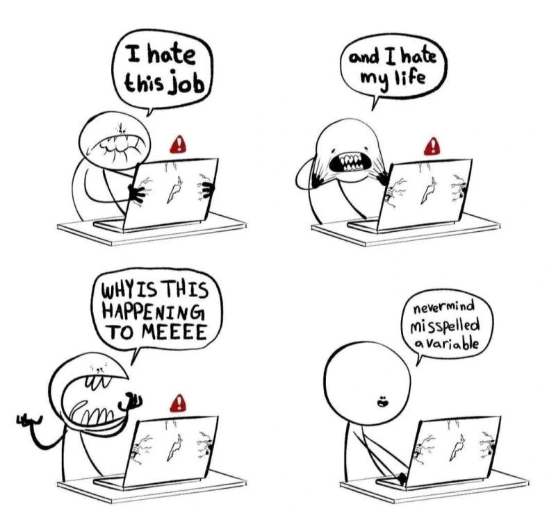

# Harjoitus 4

## Animaatioita ja kuvaefektejä

Harjoitellaan CSS:ää vielä. [Linkin takana](https://preview.themeforest.net/item/maido-multipurpose-ghost-blog-theme/full_screen_preview/24837109?_ga=2.259990478.570486835.1654146705-2133876429.1654146705)<base target="_blank"> on verkkosivu, jolla on käytetty paljon erilaisia CSS-temppuja, mukaan lukien erilaisia animaatioita (voitte valita vaalean tai tumman teeman). Tarkoitus on kopioida sivusto mahdollisimman hyvin.

1. Aloita luomalla sivuston rakenne HTML:llä uuteen tiedostoon. Voit valita kuviksi joitakin soveltuvia kuvia esim Pixabaysta.
2. Tee ensin sivuston asettelu. Huomio myös esimerkiksi paikalleen jäävä header (toimii position-ominaisuudella).
3. Lisää kuviin väriefektit.
4. Lisää viimeisenä animaatioita.

Vähimmäisvaatimukset:

1. Navigaatiopalkki (voit vaihtaa hover-efektin myös alleviivaukseen, jos et löydä tapaa tehdä pallo).
2. Sivuston otsikko.
3. Teksti sivulla pystyssä.
4. Kuvarypäs, jossa on yksi isompi ja neljä pienempää kuvaa ja kuvien päällä tekstit. Myös hover-efekti, jossa kuvat liikkuvat vähän.
5. Iso kuva, joka zoomaa lähemmäs.
6. Nappi, joka vaihtaa väriä ja pitenee hover-efektinä.

Kevennykseksi

