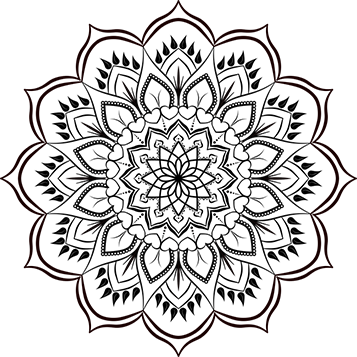

# Elementtien asemointi

## Float

*float* eli kelluttaminen on ominaisuus, jolla voidaan siirtää yksittäisiä elementtejä. Se ei sovi suuriin asetteluihin, joihin on nykyään parempiakin vaihtoehtoja, mutta yksinkertaisiin tilanteisiin se toimii. Hyvä esimerkki on elementti, jonka sisällä on kuva, joka halutaan vasemmalle, sekä tekstiä, joka halutaan pitää sen vieressä.

````html
<div class="content">
    
    <p>
        Tämä on esimerkki tekstistä, joka kiertää kuvan. Kuvan float-arvo on asetettu `left`, mikä tarkoittaa, että kuva kelluu vasemmalle, ja teksti kiertää sen oikealta puolelta. Float-ominaisuutta käytettiin aiemmin usein kuvia sisältävissä asetteluissa, koska se antaa mahdollisuuden tekstin ja kuvien sijoitteluun samalle riville.
    </p>
    <p>
        Nykyisin floatin käyttö on vähentynyt, mutta se on edelleen hyödyllinen yksinkertaisissa tilanteissa, joissa halutaan luoda lehtimäinen asettelu, jossa kuva ja teksti yhdistyvät kauniisti. Kuvan ympärille on lisätty marginaali, jotta teksti ei osu suoraan kuvaan, mikä parantaa luettavuutta.
    </p>
</div>
````

````css
        .float-image {
            float: left; /* Kelluttaa kuvan vasemmalle */
            margin: 10px; /* Lisää vähän tilaa kuvan ympärille */
            width: 200px; /* Määrittää kuvan leveyden */
        }

        .content {
            font-size: 16px; /* Tekstin koko */
            line-height: 1.6; /* Rivikorkeus parantaa luettavuutta */
        }
````

## Flexbox

*Flexbox* on yksi tavoista, joilla voidaan asemoida koko verkkosivun sisältöä.

*Flexbox*:in avulla voidaan asetella elementtejä sivulle tai toisen elementin sisällä. Elementtiä, joka sisältää toisia elementtejä, kutsutaan *flex container*:iksi. Sen sisällä on *flex item*:eja.

Periaatteessa riittää, että *flex container*:lle määritellään:

```css
.main {
    display: flex;
}
```

Tämän jälkeen kaikki sen sisällä olevat elementit eli lapset ovat automaattisesti *flex-item*:eja.

## Alkutoimet

Tallenna seuraava koodi *flextest.html*-tiedostoon:

```html
<!DOCTYPE html>
<html>
    <head>
        <meta charset="UTF-8">
        <title>Flexbox-harjoitus</title>
        <link rel="stylesheet" href="boxit.css">
    </head>
    <body>
        <main class="main">
        <div class="subdiv">
            <h1>DIV 1</h1>
        </div>
        <div class="subdiv highdiv">
            <h1>DIV 2</h1>
        </div>
        <div class="subdiv">
            <h1>DIV 3</h1>
        </div>
        <div class="subdiv widediv">
            <h1>DIV 4</h1>
        </div>
    </main>
    </body>
</html>
```

Tallenna seuraava koodi *flextest.css* -tiedostoon. *flex-container* on *main*, jonka luokka on *main* ja sen sisällä on *flex-item*:ejä, joiden luokka on *subdiv*. Yksi *subdiv*:estä kuuluu lisäksi luokkaan *highdiv* tai toinen *widediv*.

```css
.main {
    display: flex;
}

.subdiv {
    height: auto;
    width: auto;
    padding: 1em;
    border-style: solid;
    border-width: 3px;
    border-radius: 25px;
    background-color: lightblue;
}

.highdiv {
    height: 350px;
    width: 200px;
    background-color: lightseagreen;
}

.widediv {
    height: 100px;
    width: 250px;
    background-color: lightslategray;
}
```

Sivu näyttää aluksi tältä:


## Laatikoiden järjestys (*item*)

Normaalisti *div*:it luodaan sivulle siinä järjestyksessä kun ne ovat HTML-tiedostossa. Järjestykseen voi kuitenkin vaikuttaa *order*:in avulla. Oletusarvo järjestykselle on 0, joten -1 tuo *flex-item*:in alkuun, 2 vie sen loppuun jne.

```css
order: -1;
```

## Laatikoiden asettelu sivulle (*container*)

Oletusarvoidesti *flex-item*:it sijoitetaan sivulle vaakaan. Jos haluat ne pystyriviin sen voi tehdä näin:

```css
    flex-direction: column;
```

Jos *flex-item*:ien toivotaan siirtyvän uudelle riville selainikkunan kaventuessa, aktivoi *flex-wrap*:

```css
    flex-wrap: wrap;
```

Jos laatikot halutaan alkamaan vasemmalta tai oikealta reunalta, tai ne halutaan vaakasuunnassa keskelle, käytetään *justify-content*-asetusta:

```css
justify-content: center;
justify-content: flex-end;
```

Pystysuunnassa samat asetukset saadaan aikaan *align-items*:illa.

```css
align-items: flex-start;
```

## Laatikoiden koko (*item*)

Jos *flex-item*:in leveyttä tai korkeutta ei ole määritelty, se skaalautuu automaattisesti sisältönsä mukaisesti sopivan kokoiseksi. Tässä esimerkissä tällaisia vapaasti skaalautuvia *flex-item*:eitä ovat *DIV1* ja *DIV3*. Jos halutaan, että *flex-item* täyttää kaiken vapaana olevan tilan voidaan niille määritellä *flex-grow*. Kokeile asettaa kaikille *sub-div*:eille:

```css
    flex-grow: 1;
```

Laatikot voivat kasvaa myös suhteessa nopeammin kuin muut laatikot. Aseta yhdelle *high-div*:lle:

```css
flex-grow: 2;
```

Havainnollistava kuva *flex*in justify-contentista: 

[Lue lisää flex-box:ista](https://css-tricks.com/snippets/css/a-guide-to-flexbox/)<base target="_blank">

Flexboxin käyttöä voi treenata myös hauskalla tavalla pelaten [Flexbox Froggya, onnistuu myös suomeksi](https://flexboxfroggy.com/#fi)<base target="_blank">

## Demoharjoitus 1

1. Luo uusi html-tiedosto nimeltään asetteludemo1.html. Kopioi siihen allaoleva koodi. Luo sitten CSS-tiedosto, jonka nimi on asetteludemo.css.
2. Tyylittele ensin listaa siten, että siinä ei ole listamerkintöjä. Lisää myös *main*in sisällä oleville diveille jokin taustaväri ja reunukset, jotta ne erottuvat selkeästi.
3. Käytä flexboxia asettelemaan sivusto. Laita navigointipalkki vasempaan reunaan pystyyn ja anna sille leveydeksi 200px. 
4. Asettele sitten tuotteet riviin navigoinnin oikealle puolelle omaksi flexboxikseen. Säädä niitä niin, että ne rivittyvät uudelle riville ja että niiden välillä on tyhjää tilaa (joko justify-content: space-between tai justify-content: space-evenly).

````html
<!DOCTYPE html>
<html>
    <head>
        <meta charset="UTF-8">
        <title>Flexbox-harjoitus</title>
        <link rel="stylesheet" href="asetteludemo.css">
    </head>
    <body>
        <header>
            <h1>Tervetuloa kauppaamme!</h1>
            <nav>
                <ul>
                    <li>Etusivu</li>
                    <li>Tuotteet</li>
                    <li>Laatutakuu</li>
                    <li>Yhteystiedot</li>
                </ul>
            </nav>
        </header>
        <main>
            <h2>Tässä ovat tuotteemme</h2>
        <div class="tuotteet">
        <div class="subdiv">
            <h1>Tuote 1</h1>
            <p>Tuote 1 on upea.</p>
        </div>
        <div class="subdiv">
            <h1>Tuote 2</h1>
            <p>Tuote 2 on hieno.</p>
        </div>
        <div class="subdiv">
            <h1>Tuote 3</h1>
            <p>Tuote 3 on mahtava.</p>
        </div>
        <div class="subdiv">
            <h1>Tuote 4</h1>
            <p>Tuote 4 on loistava.</p>
        </div>
    </div>
    </main>
    </body>
</html>
````