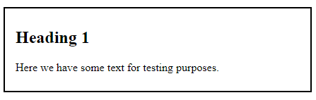
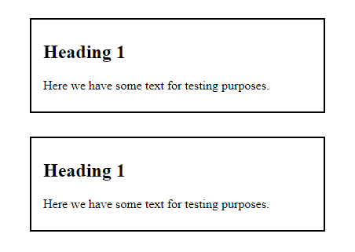

# Box Model

Kaikki HTML-elementit ovat periaatteessa laatikoita, useimmiten suorakulmioita. Näin on myös CSS:ssä, jossa näillä suorakulmioilla on eri tasoja. Puhutaan usein box modelista.

Yksittäisen elementin mallin näkee selkeästi kehittäjätyökaluista Elements-välilehdeltä. Se kertoo, mikä on elementin koko, paljonko sillä on täytetilaa, paljonko reunusta ja paljonko marginaalia.


## Padding

Padding on täytetila, joka tulee elementin sisällön (yleensä tekstin) ja elementin reunan väliin. Sitä voi säätää erikseen ylös (padding-top), alas (padding-bottom), oikealle (padding-right) ja vasemmalle (padding-left) tai suoraan yhdessä tai ylä- ja alasuunta sekä sivut yhdessä. Jos samalla lausekkeella haluaa säätää kaikille eri arvot, ne menevät järjestyksessä top, right, bottom, left. 

Alla olevalla koodilla säädetään sivut ja ylä- ja alasuunta erikseen, ensin ylä- ja ala, sitten oikea ja vasen, jolloin ylös ja alas tulee 8 pikselin padding ja oikealle ja vasemmalle 15 pikselin padding.

````css
.mydiv {
    padding: 8px 15px;
}
````

## Border
Elementille voi antaa reunukset. Reunuksille voi antaa värin (border-color), paksuuden (border-width) ja kuviotyylin (border-style). Ne voi antaa erikseen tai yhdistelmällä. On mahdollista määritellä reunus vain johonkin yksittäiseen suuntaan (esim. border-left).

[w3schools](https://www.w3schools.com/css/css_border.asp)<base target="_blank"> esittelee eri reunustyylivaihtoehdot.

Reunukset on mahdollista kirjoittaa suoraan yhdellä rivillä, kun sille antaa ensin paksuuden, sitten tyylin ja lopuksi värin. Jos elementillä on padding, se tulee tekstin ja reunuksen väliin.

````css
.mydiv {
    padding: 8px 15px;
    border: 2px solid black;
}
````
Lopputulos kapealla näytöllä on tämä:



Jos elementille annetaan taustaväri eli background-color, reunukset tulevat tämän taustan lisäksi.

## Border-radius

Elementin reunoja voi pyöristää border-radius -ominaisuudella. Sille annetaan joko pikseliarvo tai prosenttiarvo.

````
.mydiv {
    padding: 8px 15px;
    border: 2px solid black;
    border-radius: 15px;
}
````

## Box-shadow ja text-shadow

Sekä tekstille että laatikoille voi laittaa varjoefektejä.

Ohjeita ja esimerkkejä tekstien varjoista löytyy [www.w3schools.comista](https://www.w3schools.com/css/css3_shadows.asp)<base target="_blank">.

Ohjeita ja esimerkkejä laatikoiden varjoista löytyy [www.w3schools.comista](https://www.w3schools.com/css/css3_shadows_box.asp)<base target="_blank">.

_____________

## Demotehtävä 1

1. Luo demo-kansioon uusi HTML-tiedosto nimeltään boxes.html ja uusi CSS-tiedosto nimeltään boxes.css. Luo HTML-tiedostoon html-pohja ja linkitä CSS-tiedosto siihen.
2. Luo html-tiedostoon h1-otsikko, jossa lukee "Box Test", sekä sen alle kaksi div-elementtiä, joiden sisällä on p-elementissä tekstit "Box 1" ja "Box 2". Anna niille myös luokat "box1" ja "box2".
3. CSS-tiedostossa anna molemmille jokin taustaväri eli background-color. Valitse molemmille myös jokin reunus ja aseta niille keskenään eri määrä paddingia.
4. Lisää otsikkoon haluamasi varjoefekti.
5. Lisää laatikoille haluamasi varjoefektit. Ne voivat olla samat tai erit.

__________

## Margin

Margin eli marginaali on tilaa reunusten ulkopuolella. Sitä voi säätää joko joka suuntaan erikseen (esim. margin-top ja margin-left) tai kahta tai kaikki yhdessä.

Alla lisätään joka suuntaan marginaalia 30 pikseliä.

````css
.mydiv {
    padding: 8px 15px;
    border: 2px solid black;
    margin: 30px;
}
````

HTML-sivulla on automaattisesti pikkuinen marginaali olemassa. Yleensä omaa CSS:ää kirjoitettaessa se halutaan poistaa, jotta voimme säätää omat marginaalit. Tämä tehdään mieluiten aivan CSS-tiedoston alussa kirjoittamalla sinne: ``* {margin:0;}``. Tähti tarkoittaa kaikkea eli tuolla koodilla säädetään, että kaikkialla on lähtökohtaisesti marginaali 0.

## Margin Collapse

Margin collapse on sitä, että jos meillä on allekkain tai vierekkäin kaksi elementtiä, joille on lisätty marginaali, niistä marginaaleista lasketaan vain yksi. Eli niistä pienempi marginaali ikään kuin katoaa/kaatuu pois. 

Esimerkissä on kaksi laatikkoa, joilla molemmilla on joka suuntaan marginaalia 30 px. Kuva on otettu aivan selaimen reunasta. Huomaatte, että laatikoiden vasemmalla puolella on sama etäisyys reunasta kuin laatikoiden välillä eli 30 pikseliä eikä tuplia eli kaksi kertaa 30 pikseliä. Tätä margin collapse käytännössä tarkoittaa.



_____________

## Demotehtävä 2

1. Aiempiin tiedostoihin lisää ensimmäiselle laatikolle marginaalia 100 pikseliä ja toiselle 50 pikseliä. Lisää myös alkuun ``* {margin: 0;}``.
2. Mene kehittäjätyökaluihin katsomaan, kuinka paljon väliä laatikoilla on.

______________

# Height ja Width

Jokaiselle elementille voi määrittää korkeuden (height) ja leveyden (width). Se voidaan antaa suoraan pikseleinä tai esimerkiksi prosentteina käytettävästä tilasta.

## Height

Korkeuden säätäminen on yleensä selkeää ja siihen käytetään hyvin yleisesti pikselimäärää. 

## Width

Leveyttä voidaan säädellä useammalla tavalla. Pikselit ovat yksi mahdollisuus, mutta myös prosentit ovat mahdollisia, mikä tekee leveydestä muuttuvan, kun ruudun leveys vaihtuu.

Lisäksi voidaan määrittää ``max-width``. Se kertoo, mikä on suurin leveys, mikä elementillä voi olla. Tämä voi joissakin tapauksissa selkeyttää eri kokoisten ruutujen kanssa toimimista. Jos elementti on määritelty liian leveäksi ruutuun nähden, tulee mahdollisuus kelata sivua sivuttaissuunnassa, mutta tätä haluamme yleensä välttää.

````CSS
.examplediv {
    padding: 8px 15px;
    border: 2px solid black;
    margin: 30px;
    height: 400px;
    width: 1200px;
    max-width: 90%;
}
````

____________

## Demotehtävä 3

1. Jatka edellisiin tiedostoihin. Anna ensimmäiselle laatikolle korkeudeksi 200 pikseliä ja toiselle 300 pikseliä.
2. Anna molemmille leveydeksi 800 pikseliä. Huomaat, että ne eivät silti ole yhtä leveitä, koska niissä on eri määrä paddingia.
3. Anna latikoista leveämmälle lisäksi maksimileveys, joka on 80 %. Testaa kaventaa selainta kännykän leveyteen. Mitä tapahtuu?

______________

# Border-box

Lähtökohtaisesti paddingiä ja borderia ei lasketa elementin kokoon, vaan ainoastaan elementin varsinainen sisältö. Tämän vuoksi voi olla hankalaa arvioida elementtien lopullisia kokoja. Aika usein lisätään määritelmä ``box-sizing: border-box;`` ja se saatetaan laittaa koskemaan koko HTML-tiedosto eli merkitä tähdellä samaan paikkaan kuin ``margin:0;``. Silloin padding ja reunus lasketaan mukaan elementin kokoon ja voimme paremmin hallita elementin kokoa.

________________

## Demotehtävä 4

1. Lisää css-tiedoston alkuun ``box-sizing: border-box;``. Ovatko laatikot nyt keskenään yhtä leveitä isolla näytöllä?

____________

# Display

Display on tärkeä ominaisuus, joka säätelee sitä, miten asiat asettuvat ruudulle tai miten ne näkyvät. Osalla elementeistä on jokin oletus display. Tulemme opettelemaan näitä useammassa osassa.

*block* elementti alkaa aina uudelta riviltä ja se vie niin paljon tilaa leveydestä, kuin sitä on saatavilla niin oikealla kuin vasemmallakin. *block* on oletuksena seuraavilla elementeillä: ``<div>, <h1>-<h6>, <p>, <form>, <header>, <footer>, <section>``.

*inline* sen sijaan ei ala uudelta riviltä, ja se vie vain sen verran tilaa, kuin se välttämättä tarvitsee. Esimerkiksi ``<span>``, ``<a>``, ja ```` ovat tällaisia elementtejä.

*none* poistaa elementin näkyvistä siten, että sen varaama tila täytetään muilla sivun elementeillä, mikäli sellaisia on. On myös toinen tapa tehdä jostakin elementistä näkymätön ja se on *visibility: hidden;*, jolloin elementti vie edelleen vanhan tilan, mutta se vain on poissa näkyviltä.

_____________

## Demotehtävä 5

1. Jatka aiempiin tiedostoihin. Testaa, mitä tapahtuu, jos vaihdat molempiin laatikoihin *display: inline;*.
2. Vaihda ensimmäiseen laatikkoon *display: none;* ja katso, mitä tapahtuu.
3. Vaihda ensimmäisen laatikon *display: none;* *visibility: hidden;*iksi. Mitä muutoksia tapahtuu?