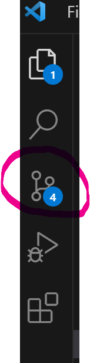
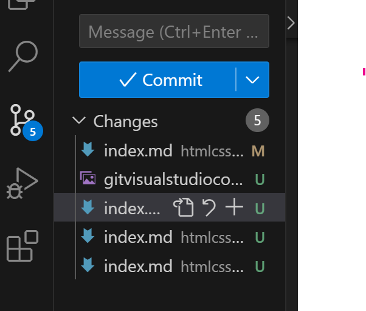

# Gitin perusteet

Git on versiohallintajärjestelmä. Sillä pidetään kirjaa siitä, miten tiedostot muuttuvat ajan kuluessa – erityisesti ohjelmistoprojekteissa. Gitin avulla voidaan:

- tallentaa projektista eri versioita

- jakaa projekti helposti toisten kanssa

- palata aiempiin vaiheisiin, jos jokin menee pieleen

- seurata, mitä on muutettu, milloin ja miksi

- tehdä työtä useamman henkilön kanssa samassa projektissa ilman että työ menee sekaisin

## Miksi Git on tärkeä ohjelmistokehityksessä?
Ohjelmointi on jatkuvaa kokeilua ja kehittämistä. Gitin avulla voit esimerkiksi:

- kokeilla uusia ideoita ilman pelkoa, että rikot pysyvästi toimivan version

- tehdä selkeitä tallennuspisteitä (commit), joihin voi palata

- yhdistää useiden kehittäjien tekemät muutokset samaan projektiin (tähän käytetään mm. brancheja ja mergejä)

- käyttää GitHubin tai GitLabin kaltaisia palveluita, joissa projektit säilyvät pilvessä (me käytämme GitHubia töiden palauttamiseen opettajille)

## Gitin käytön aloittaminen

1. Ensimmäisenä käy tekemässä käyttäjätili [GitHubiin](https://github.com). Voit käyttää omaa henkilökohtaista sähköpostiasi tai koulun sähköpostia. Valitse itsellesi helposti tunnistettava käyttäjänimi (*etunimi_sukunimi* on varsin hyvä).

2. GitHubissa luo uusi *private repository* nimeltään *perehdytys*.

3. Kutsu opettaja osalliseksi repositoryyn kohdasta *settings -> manage access -> invite teams or people* 

4. Tee tietokoneellesi *Tiedostot*-kansioon uusi kansio nimeltään *Perehdytys*. Avaa sitten kyseiseen paikkaan *Git Bash* (valitse ensin kansio ja oikealla hiiren napilla saat vaihtoehdon *Avaa päätteessä*). Varmista, että avautuvassa ikkunassa tekstirivin viimeisenä on *perehdytys>*. Silloin olet oikeassa paikassa.

5. Luo komentorivillä uusi kansio nimeltään *markdown* kirjoittamalla ``mkdir markdown``. Siirry sitten kyseisen kansion sisään kirjoittamalla ``cd markdown``.

6. Luo kansion sisään uusi tiedosto nimeltään index.md kirjoittamalla komentoriville seuraava komento ``echo "# Esittely" >> index.md``.

7. Palaa takaisin edelliseen kansioon *Perehdytys* kirjoittamalla komentoriville ``cd..``.

8. Seuraavaksi lisäämme kansion ja tiedoston Gitiin seuraavilla komennoilla:

- ``git init``
- ``git add``
- ``git commit -m "Start"``
- ``git remote add origin <liitä tähän oman repositorysi osoite>``
- ``git push -u origin master``

9. Tarkista, saitko tiedoston siirtymään GitHubissa olevaan repositoryyn (tarvittaessa päivitä GitHub-sivu).

10. Avaa Markdown-tiedosto Visual Studio Codella ja lisää siihen pari lausetta tekstiä. Tallenna se.

11. Tee uusi commit ja lisää muutokset GitHibiin.
``git commit -m "Esittelytekstiä"``
``git push -u origin master``

Gitiä voi käyttää myös Visual Studio Coden kautta, jolloin komentoriville ei ole pakko kirjoittaa asioita.

Vasemmassa reunassa on palkki, josta löytyy mahdollisuus käyttää Gitiä, jos kyseinen kansio on lisätty Gitiin.

Jos sen vieressä on sininen pallo, jossa on numeroita, se kertoo, että sinulla on niin moneen tiedostoon tehtyjä muutoksia, joista ei ole vielä tehty commitia.

Voit tehdä Visual Studio Codessa commitin, kun kirjoitat kenttään commitin mukana tulevan viestin (mielellään lyhyesti, mitä muutoksia olet viimeksi tehnyt) ja painat *Commit* -nappia.

Opettelemme myöhemmin lisää Gitin käyttöä. Voit lukea lisää Gitin käytön ohjeita sivulta [Github-ohjeita](https://otredu.github.io/github/)<base target="_blank">.