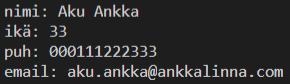

# Harjoitukset 3

**Ennen näitä harjoituksia tutustu aiemmin kurssilla käytyihin asioihin ja tarvittaessa kertaa niitä.**

Tee Visual Studio Code:lla uusi tiedosto, nimeä se *harjoitukset3.js*. Avaa VS:n terminaali ja aja koodi kirjoittamalla konsoliin: *node harjoitukset3.js*. Kirjoita kaikki tehtävät samaan tiedostoon allekkain.


## Tehtävä 1

Tee taulukko (array), johon tallennat viisi muistettavaa asiaa (muistilista). Tallenna taulukko muuttujaan. Tulosta taulukon alkiot ranskalaisin viivoin consolille kahdella eri tavalla:

- for-loopin avulla
- foreach()-metodin avulla


## Tehtävä 2

Lisää edelliseen taulukkoon kaksi uutta muistettavaa asiaa (käytä *push()*-metodia) ja poista siitä ensimmäinen muistettava asia (käytä *shift()*-metodia). Tulosta muutettu taulukko jokaisen muutoksen jälkeen jollakin harjoituksen 1 tyylillä.

## Tehtävä 3

Kopioi alla oleva taulukko. Tee funktio, joka ottaa vastaan kyseisen taulukon ja palauttaa pienimmän luvun. Tulosta luku konsoliin muodossa: "The smallest number is " + number. Tee funktiossa avuksi ylimääräinen muuttuja, johon tallennat aina pienimmän luvun.

````js
const numberArray = [4, 6, 2, -2, 7, -4, 9];
````

## Tehtävä 4

Tee olio, johon tallennat keksityn henkilön henkilötiedot: nimi, osoite, ikä, puhelinnumero ja sähköposti (esim. Aku Ankka). Tee funktio, joka ottaa parametrina henkilötieto-olion ja tulostaa konsolille sen sisältämät tiedot. Tulosta konsolille funktiosi avulla keksityn henkilön tiedot. Vinkki: rivinvaihto on \n.

Tulostuksen malli:



## Tehtävä 5

Tee taulukko, jossa on vähintään kolme henkilötieto-olioita (Hessu Hopo, Iines Ankka, Roope Ankka jne) eli kaksiulotteinen taulukko. Tulosta kaikkien tiedot konsolille käyttämällä harjoituksessa 3 tekemääsi funktiota. Käytä for-looppia tai foreach()-metodia.

## Tehtävä 6

Tee kaksiulotteinen taulukko, jossa on päiväjärjestys eli jokaisella rivillä on tekeminen sekä tekemisen tuntimäärä, esim. ``["Breakfast", 0.5]``. Taulukossa pitää olla vähintään viisi tekemistä. Tee funktio, joka saa taulukon parametriksi. Funktio palauttaa sen tekemisen, johon on mennyt eniten aikaa. Tulosta tekemisen nimi ja käytetty tuntimäärä.

## Lisätehtävä 1

Kokeile lisätä henkilötieto-oliolle tehtävästä 5 metodi, joka tekee tulostuksen. Metodi on funktio, joka liitetään olion ominaisuudeksi. Tulosta yksi olio konsolille metodin avulla. Vinkki: muista käyttää *this*.
