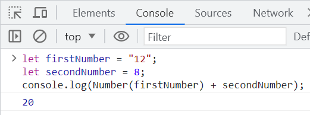

# Muuttujien muuntaminen

## Matemaattiset operaatiot

JavaScriptillä voidaan tehdä monenlaisia matemaattisia laskutoimituksia.

Tässä ovat matemaattiset operaattorit:

| Operaattori    | Esimerkkejä    | 
| --------------------- |:-------------:| 
| + (yhteenlasku) | ```4 + 5 ``` | 
| - (vähennyslasku) | ```4.5 - 3.1 ``` |
| * (kertolasku)| ```90 * 0.23``` |
| / (jakolasku) | ```3 / 20``` |
| ** (potenssiin korotus) | ``` 2 ** 10``` |
| % (modulo, jakojäännös) | ``` 10 % 6``` |

Laskujärjestys ilmoitetaan sulkujen avulla:
```js
(20 + 3)/(14 - 2)
```

Nämä toimivat, jos kaikki muuttujat ovat tyyppiä *number*. 

## Demotehtävä 1

Tehdään muutama yksinkertainen lasku JavaScriptillä.

1. Luo ensin kaksi muuttujaa. *let firstNumber = 18;* ja *let secondNumber = 7;* Tulosta niiden summa konsoliin: *console.log(firstNumber + secondNumber);* . 
2. Luo uusi muuttuja nimeltään *sum*. Anna sille arvoksi *firstNumber + secondNumber*. Tulosta *sum* konsoliin.
3. Vähennä *firstNumber*ista *secondNumber* ja tulosta se konsoliin.
4. Jaa *sum* *secondNumber*illa ja tulosta se konsoliin.

___

## Tyyppimuunnokset

Koska JavaScript on dynaamisesti tyypitetty ohjelmointikieli, muuttujan tyyppiä on mahdollista vaihtaa ja joissakin tilanteissa JavaScript tekee sen automaattisesti. 

Jos käyttäjä haluaa vähentää numeron merkkijonosta, se onnistuu, mikäli merkkijono sisältää ainoastaan numeroita. 


Kuitenkin jos merkkijonoon, jossa on vain numeroita, yrittää lisätä numeron, tapahtuukin jotain muuta. 


Tässä tapauksessa JavaScript kohtelee molempia ikään kuin ne olisivat merkkijonoja. 

Ohjelmoija voi halutessaan muuntaa useita muuttujia eri tyyppisiksi välttääkseen tällaiset ongelmat.

````JS
let firstNumber = "12";
let secondNumber = 8;
firstNumber = Number(firstNumber);
````

Aiemman lisäämisongelman voisi ratkaista myös tällä tavalla: 



Numeron voi muuntaa myös merkkijonoksi:

````JS
let secondNumber = 8;
secondNumber = String(secondNumber);
````

___

## Merkkijonot

___

## Totuusarvojen vertailu
