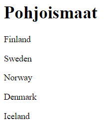
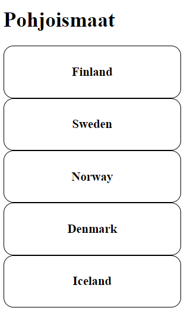
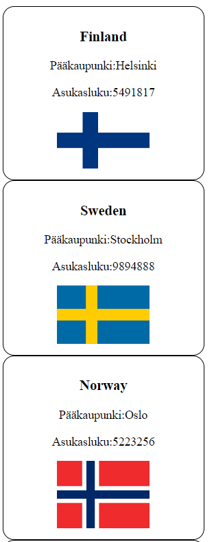

# Pohjoismaat - demo


### Koodin jakaminen useampaan tiedostoon

Kun ohjelma tulee monimutkaisemmaksi, ei aina ole järkevää sijoittaa kaikkea JavaScript-koodia samaan tiedostoon.

Otamme tässä käyttöön JavaScript - moduulit. Toisesta moduulista *export*:ataan ja toiseen moduuliin *import*:ataan. Moduulista voidaan *export*:ata funktioita, muuttujia, luokkia jne. Riittää, että määritelmän eteen kirjoittaa *export*;

Kopioi seuraava koodi ja tallenna se *countries-data.js*-nimellä. Tiedosto sisältää taulukon, jossa on viisi oliota, jotka sisältävät pohjoismaihin liittyvää tietoa.

```js
export let countries = [
    {   name:"Finland",
        capital:"Helsinki",
        population:5491817,
        flag:"https://upload.wikimedia.org/wikipedia/commons/b/bc/Flag_of_Finland.svg"
    },
    {   name:"Sweden",
        capital:"Stockholm",
        population:9894888,
        flag:"https://upload.wikimedia.org/wikipedia/en/4/4c/Flag_of_Sweden.svg"
    },
    {   name:"Norway",
        capital:"Oslo",
        population:5223256,
        flag:"https://commons.wikimedia.org/wiki/File:Flag_of_Norway.svg"
    },
    {   name:"Denmark",
        capital:"Copenhagen",
        population:5717014,
        flag:"https://upload.wikimedia.org/wikipedia/commons/9/9c/Flag_of_Denmark.svg"
    },
    {   name:"Iceland",
        capital:"Reykjavík",
        population:334300,
        flag:"https://commons.wikimedia.org/wiki/File:Flag_of_Iceland.svg"
    }]
```

Tee toinen tiedosto, johon *import*:ataan em. modulista *countries*-taulukko. Tallenna tiedosto nimellä *countries.js*.

```js
import { countries } from './countries-data.js';
```

Nyt *HTML*-tiedostossa pitää ladata molemmat JavaScript-tiedostot, ja niille pitää merkitä tyypiksi *module*.

Tallenna seuraava koodi *countries.html*-tiedostoon:

```html
<!DOCTYPE html>
<html>
<head>
    <meta charset="UTF-8">
    <title>Pohjoismaat</title>
    <link rel="stylesheet" href="countries.css">
</head>
    <body>
        <h1>Pohjoismaat</h1>
        <div id="countrylist"></div>
        <script type="module" src="countries-data.js"></script>
        <script type="module" src="countries.js"></script>
    </body>
</html>
```

Harjoitus tarvitsee myös *CSS*-tiedoston. Tallenna sen koodi *countries.css*-tiedostoon.

```css
img {
    max-width:50%;
    max-height:50%;
  }

.country {
    border-style: solid;
    border-width: 1px;
    border-radius: 15px;
    width: 30%;
    padding: 10px;
    text-align: center;
}
```

### Webbiserverin käynnistys

Tämä demo tarvitsee toimiakseen webbiserverin (PHP-development server riittää), käynnistä se:

```cmd
php -S localhost:8888
```

Huom! Jos teet näitä tehtäviä kotona, [asenna XAMPP](https://www.apachefriends.org/download.html), sen mukana saat PHP-development server:in.

### Plan B (jos et saa edellistä kohtaa toimimaan)

HUOM! Jos et saa PHP-development serveriä toimimaan, voit tehdä tämän demon myös ilman koodimoduleja. Kopioi *countries*-taulukko suoraan countries.js-tiedoston alkuun (et siis tarvitse *countries-data.js* - tiedostoa). Kommentoi pois *export* ja *import* osuudet koodista:

```js
/*export*/ let coutries = ...
/*import { countries } from './countries-data.js';*/
```

Poista moduulit käytöstä myös *countries.html*-tiedostosta:

```html
  <!-- <script type="module" src="countries-data.js"></script> -->
  <script src="countries.js"></script>
```

Nyt voit avata *countries.html*-tiedoston suoraan levyltä selaimeen, etkä tarvitse webbiserveriä.

### Step 1:  Maiden nimet sivulle

Tämä harjoitus tehdään kokonaan kirjoittamalla JavaScript:iä. Emme siis muokkaa HTML-tiedostoa tai CSS-tiedostoa ollenkaan. Tieto pohjoismaista liitetään HTML-tiedostossa sijaitsevaan *div*:iin, jonka *id* on "countrylist". Tähän *div*:iin luodaan dynaamisesti riittää määrä pohjoismaiden tietoa sisältäviä *div*:ejä. Ensin haetaan ko. elementti ja tallennetaan se muuttujaan "countryList"

```js
let countryList = document.getElementById("countrylist");
```

Tehdään apufunktio *newTextElem*, jonka avulla voidaan luoda uusia tekstiä sisältäviä elementtejä. Funktiolle annetaan parametriksi halutun elementin teksti *text* (esim. "Heippa") sekä elementin tyyppi *type* (esim. "H1"). Funktio palauttaa luodun elementin.

```js
function newTextElem(text, type){
    let myElem = document.createElement(type)
    myElem.textContent = text;
    return myElem;
}
```

Kutsutaan nyt *newTextElem*-funktiota taulukon *forEach*-metodin avulla (HUOM! tässä käytetään JavaScriptin nuolifunktiota), jokaiselle maan nimelle. Jokainen luotu elementti lisätään *countryList*-div:iin (*append*):

```js
countries.forEach(country => {
    let elem = newTextElem(country.name, "p");
    countryList.appendChild(elem);
});
```

Sivulla näkyy nyt maiden nimet:



### Step 2: Lisätään maalle oma div ja luokka

Koska maat tulevat sisältämään enemmänkin tietoa, tehdään niille jokaiselle oma div. Muutetaan samalla maan nimi *H3*-tyypin otsikoksi.

Tehdään funktio *newCountryDiv*, joka saa parametrinaan *country*-olion. Funktiossa luodaan maan tietoja varten tyhjä *div*-elementti. Lisätään siihen uusi tekstielementti, jonka tyyppi on "H3" ja jonka tekstinä on maan nimi. Jotta CSS-selektori toimisi oikein, lisätään *div*:lle myös luokaksi "country". Funktio palauttaa luodun div:in.

```js
function newCountryDiv(country){
    let myDiv = document.createElement("div");
    myDiv.className = "country";

    let myTitle = newTextElem(country.name,"H3")

    myDiv.append(myTitle);

    return myDiv;
}
```

Sivulla ei vielä näy mitään, koska emme ole kutsuneet tätä uutta funktiota. Tehdään se jälleen käyttämällä *forEach*-metodia. Jokainen luotu elementti lisätään kuten aikaisemminkin *countryList*-div:iin (*append*):

```js
countries.forEach(country => {
    let elem = newCountryDiv(country);
    countryList.appendChild(elem);
});
```

Nyt HTML-sivulla pitäisi näkyä pohjoismaiden nimet omissa *div*:eissään.



### Step 3: Lisätään maalle tapahtumakuuntelija

Lisätään otsikoihin toiminallisuus, jossa hiiren vieminen otsikon päälle muuttaa sen värin punaiseksi.

Lisätään maiden otsikoille tapahtumakuuntelijat (addEventListener) määrittämällä tapahtuman (*event*) tyyppi jota kuunnellaan (tässä "mouseon" ja "mouseout"), sekä antamalla *callback*-funktio, jota kutsutaan kun ko. tapahtuma tapahtuu. Tässä *callback*-funktion nimi on *changeColor*.

```js
function changeColor(elem, color){
    elem.style.color = color;
}
```

Lisää nämä koodirivit *countryDiv*-funktioon:

```js
myTitle.addEventListener("mouseover", () => changeColor(myTitle, "red"));
myTitle.addEventListener("mouseout", () => changeColor(myTitle, "black"));
```

Nyt maan nimen pitäisi muuttua punaiseksi, kun hiiri viedään sen päälle ja mustaksi kun se viedään pois.

### Step 4: Lisätään maatietoa

Nyt lisätään otsikoiden alle lisätietoa kustakin maasta ml. maan lipun. Tehdään sitä varten uusi apufunktio *countryData*, joka luo uuden divin, ja sinne tiedot pääkaupungista, asukasluvusta ja maan lipun kuvan. Funktio palauttaa luodun div:in. Huom! *append*:in avulla voi lisätä useammankin elementin kerralla, *appendChild* toimii vain yhdelle kerrallaan.

```js
function newInfoDiv(country){
    let myDiv = document.createElement("div");

    let myCapital = newTextElem( "Pääkaupunki:" + country.capital, "p");
    let myPopulation = newTextElem("Asukasluku:" + country.population, "p");
    let myImage = document.createElement("img");
    myImage.src = country.flag;

    myDiv.append(myCapital, myPopulation, myImage);

    return myDiv;
}
```

Jotta uusi *countryData*:n palauttama *div*-elementti saadaan mukaan, kutsutaan sitä (*newCountryDiv*-funktiossa) ja lisätään se append:illa otsikon perään:

```js
let myInfoDiv = newInfoDiv(country);
myDiv.append(myTitle, myInfoDiv);
```

Nyt sivulla pitäis näkyä maiden nimet, sekä niihin liittyvä lisätieto jokaisen otsikon alla.



### Step 5: Piilotetaan/näytetään lisätieto otsikkoa klikkaamalla

Jotta sivulle mahtuisi enemmänkin maita, piilotetaan yksityiskohtaista dataa sisältävät *div*:t. Lisää seuraava koodirivi *countryDiv*-funktioon:

```js
myInfoDiv.style.display = "none";
```

Nyt lisätiedot katosivat näkyviltä. Lisätään uusi tapahtumakuuntelija (*newCountryDiv*-funktioon edellisten jatkoksi), niin että maan nimeä klikkaamalla saadaan data näkyviin ja uudelleen klikkaamalla taas piilotettua. 

```js
myTitle.addEventListener("click", () => toggleData(myInfoDiv));
```

Tässä *callback*-funktioksi annetaan *toggleData*-funktio, joka muuttaa elementin näkyvyyttä:

```js
function toggleData(item){
    if(item.style.display === "none"){
        item.style.display = "block";
    } else {
        item.style.display = "none";
    }
}
```

Nyt sivun pitäisi toimia niin, että aluksi näytetään pelkät maiden nimet mutta maan nimeä klikkaamalla näytetään lisätietoja ml. maan lippu.