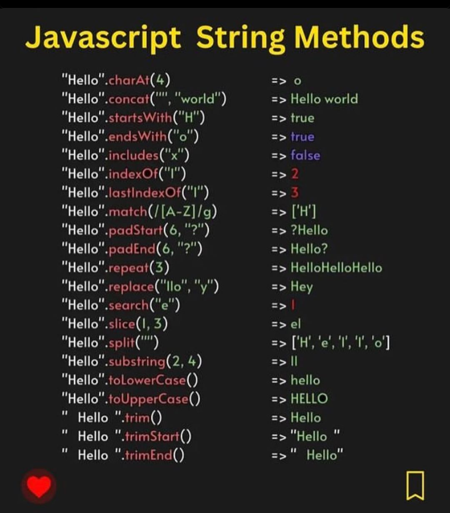

# Taulukoiden metodit

Olemme käyneet läpi taulukoista perusteet, mutta taulukoilla on joukko metodeja, joita on hyvä harjoitella lisää.

Alla olevassa kuvassa on listaus useimmista metodeista.

## Demotehtävä 1
1. Luo uusi JavaScript-tiedosto.
2. Luo sinne muuttuja nimeltään *sentence* ja anna sille arvoksi *This is my test sentence.*.
3. Testaa eri merkkijonometodeja lauseellasi. Tee vähintään 10 eri testiä, joiden tulokset näkyvät konsolissa.

# JSON

JSON (JavaScript Object Notation) on ohjelmointikielistä riippumaton tapa muotoilla dataa. On hyvin tyypillistä, että tietokannasta saadaan dataa juuri JSON-muodossa. Vaikka se on muodoltaan hyvin lähellä JavaScriptin olioita, tarvitaan pikkuisen käsittelyä, jotta se saadaan toimimaan JavaScriptillä.