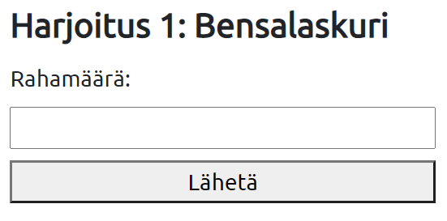
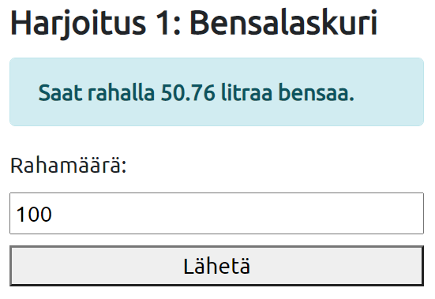
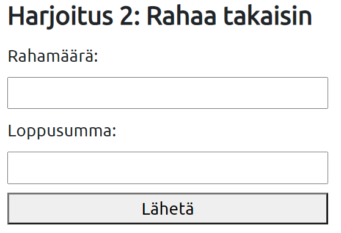
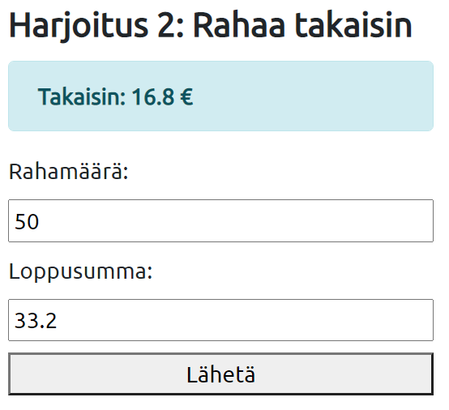
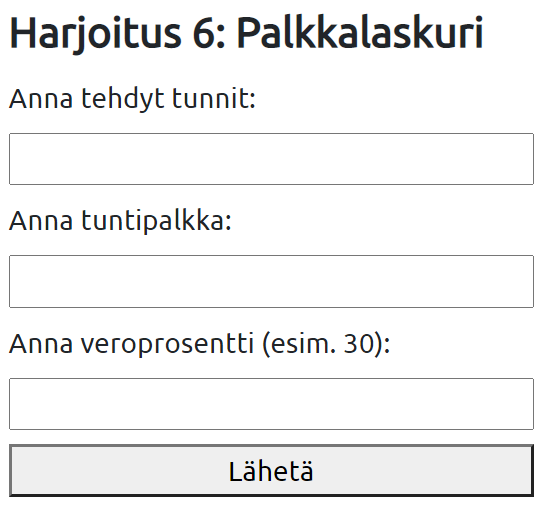
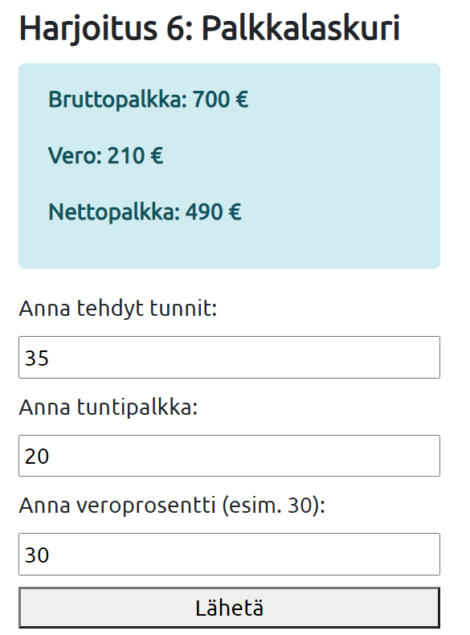
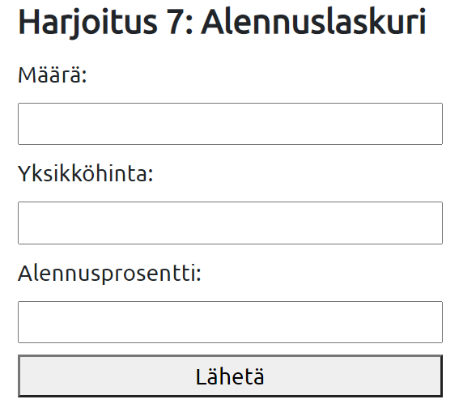
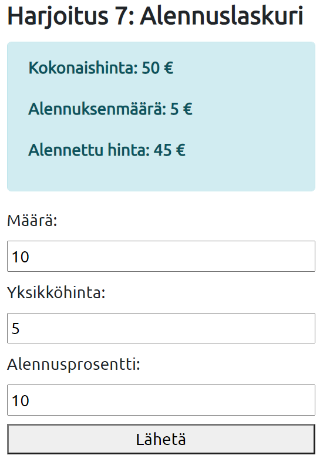
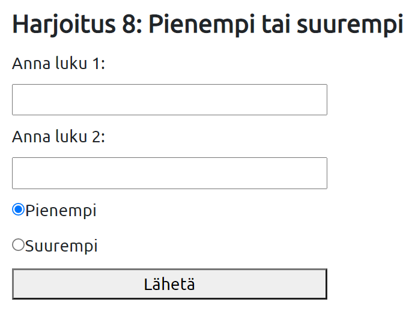
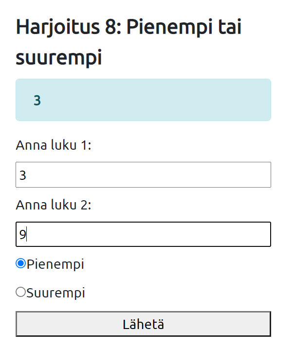

# Harjoitukset 2

**Ennen näitä harjoituksia tutustu osioihin sivuston jakaminen, parametrit sivustolla ja lomakkeet.**

Käytä *submit form*:ia parametrien välittämiseen ohjelmalle (saat ne superglobaalin muuttujan *$_GET* kautta).

Luo uusi kansio nimeltään phpharjoitukset2. 

Huom! Pyöristä arvot [ohje](https://www.php.net/manual/en/function.round.php)<base target="_blank">.

Huom! Lisää hintoihin €-merkki tulostuksessa.

Huom! Jos kenttään kirjoitetaan suomalainen desimaali pilkulla, pitää laskutoimtusta varten vaihtaa se pisteeksi ja tulostukseen taas piste pilkuksi. [ohje](https://www.geeksforgeeks.org/how-to-replace-string-in-php/)<base target="_blank">

---

### Tehtävä 1

Tee harjoituksille palautussivu. Sillä pitää olla header, jossa lukee "PHP-harjoitukset 2". Sen alla on navigaatiopalkki, johon tulee linkki jokaiseen harjoitukseen. Luo nämä omaan tiedostoon, jotta saat linkitettyä sen jokaiseen harjoitukseen. Etusivulle eli index.php-sivulle liität jonkin kuvan ja kerrot, että kyseisellä sivustolla on joukko harjoituslomakkeita. Lopuksi laadit vielä footerin, jossa on copyright. Myös se pitää yhdistää jokaisen harjoituksen sivulle. Tee CSS:n avulla sivustosta siisti. Sinulla kuuluu siis lopulta olla kymmenen tiedostoa (index.php, header.php, footer.php, CSS-tiedosto, kuvatiedosto ja jokaiselle viidelle lomaketehtävälle omat tiedostot + mahdolliselle lisätehtävlle oma).

### Tehtävä 2

Laadi PHP:n avulla ohjelma, joka laskee ja tulostaa, montako litraa bensaa tietyllä rahamäärällä saa. Pyydä lomakkeen avulla käytössä oleva rahamäärä, voit olettaa bensan hinnaksi 1,799 euroa/litra. 

*Huom!* PHP käyttää desimaalipistettä pilkun sijaan.




Tulostus voisi näyttää esim. tältä:



---

### Tehtävä 3

Laadi ohjelma, joka pyytää lomakkeella syötteinä ostosten loppusumman ja asiakkaan antaman rahamäärän, ja laskee ja tulostaa, paljonko asiakas saa takaisin. Esimerkiksi jos maksat satasella alle satasen ostokset, paljonko saat takaisin. Jos rahat eivät riitäkään, ohjelma tulostaa "Anna lisää rahaa" sekä tarvittavan rahamäärän.



Tulostus voisi näyttää esim. tältä:



---

### Tehtävä 4

Laadi ohjelma, joka pyytää lomakkeella työntekijän työtunnit, tuntipalkan sekä ennakonpidätyksen veroprosentin, ja laskee ja tulostaa bruttopalkan, veron määrän ja nettopalkan.



Tulostus voisi näyttää esim. tältä:



---
### Tehtävä 5

Laadi ohjelma, joka pyytää lomakkeella tuotteen yksikköhinnan ja tilatun määrän sekä alennusprosentin, ja laskee sekä tulostaa kokonaishinnan (ilman alennusta), alennuksen määrän sekä alennetun hinnan. Mikäli kokonaishinta ylittää 300 €, annetaan vielä 5 % lisäalennus, joka ilmoitetaan myös sivulla.



Tulostus voisi näyttää esim. tältä:



---
### Tehtävä 6

Laadi ohjelma, jossa käyttäjää pyydetään syöttämään kahteen lomakekenttään luvut ja radionapin avulla tiedon siitä, haluaako hän tulostettavaksi suuremman vai pienemmän luvun. Haluttu luku tulostetaan ruudulle.



Tulostus voisi näyttää esim. tältä:



*Vihje:*

Radionapit tehdään näin: 

```html
suurempi: <input type="radio" name="valinta" value="suurempi">
pienempi: <input type="radio" name="valinta" value="pienempi">
```

Valinnan lukeminen:
```php 
if($_POST["valinta"]=="pienempi")
```
Voit tehdä toisen valituksi kirjoittamalla:

```html
suurempi: <input type="radio" name="valinta" value="suurempi" checked="checked">
```
## Lisätehtävä 1

Laadi tietokoneaiheinen tietokilpailu (voit myös valita jonkin muun aiheen esim. sanakoe, päässälaskukoe):

Kysymyksiä on 10, jokaisesta voi saada yhden pisteen.

Lomakkeessa on tekstikenttiä, radionappeja ja valintaluetteloita (miksi ei valintaruutuja?). Pisteitä kertyy jokaisesta kysymyksestä, mutta vertailutaulukko on seuraava:

pisteitä 1 - 3, arvosana on välttävä
pisteitä 4 - 5, arvosana on tyydyttävä
pisteitä 6 - 8, arvosana on hyvä
pisteitä 9 - 10, arvosana on kiitettävä

Peli näyttää arviointitaulukon ja antaa käyttäjälleen selkeän palautteen siitä mikä vastaus oli oikein ja paljonko siitä tuli pisteitä. Tee palaute switch-case-rakenteen avulla.

Muotoile ulkoasusta hyvännäköinen.