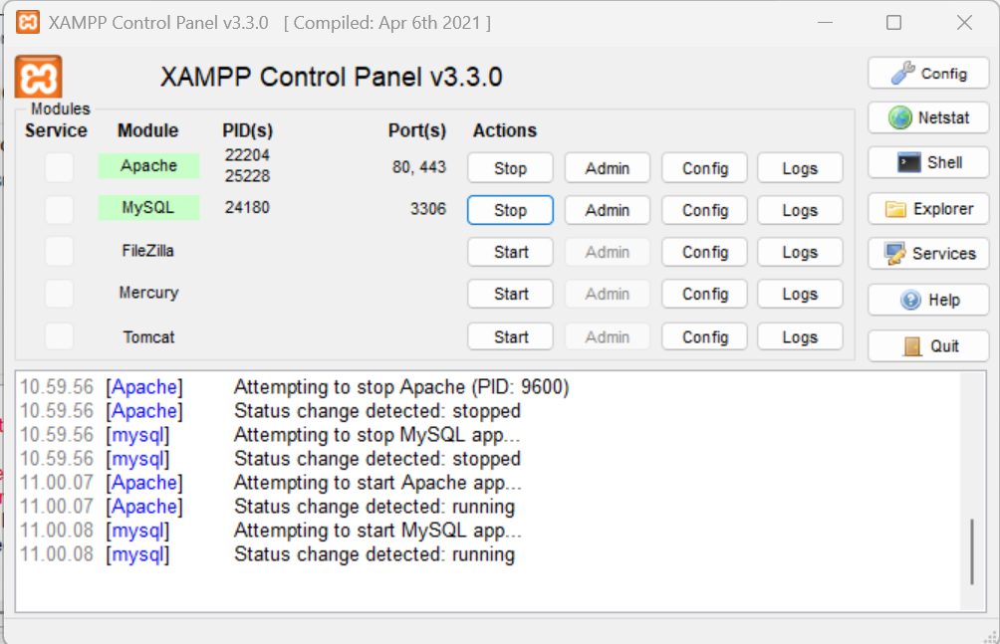

# Tietokannan luominen ja käsittely

Testaamme oman tietokannan luomista ensin paikallisella koneella.

1. Avaa sovellus nimeltään XAMPP. 
2. Käynnistä palvelut nimiltään *Apache* ja *MySQL*.
3. Avaa nettiselaimeen sivu *http://localhost/phpmyadmin



phpMyAdminissa on graafinen tietokannan hallinta, joten sen kautta ei ole välttämätöntä osata kovin paljon varsinaisia SQL-komentoja, mutta teemme ensimmäisen tietokannan komentoja käyttäen.

## Uusi tietokanta

Uusi tietokanta luodaan komennolla ``CREATE DATABASE school;``

Se ei vielä sisällä yhtään taulua eikä siten myöskään dataa.

Jos käytämme puhtaasti konsolipohjaisesti tietokantaa, meidän pitää seuraavaksi ottaa tietokanta käyttöön komennolla ``USE school;``

## Uusi taulu tietokantaan

Tietokannassa tiedot tallennetaan tauluihin. Uusi taulu luodaan komennolla ``CREATE TABLE``. Tämän lisäksi meidän täytyy antaa taululle nimi sekä sarakkeet ja sarakkeiden tietotyypit.

Jos olisimme tekemässä *school*-tietokantaan taulua nimeltään *Students*, se voisi näyttää seuraavalta:

````sql
CREATE TABLE Students (
    id INT,
    name VARCHAR(100),
    age INT
);
````

## Yleisimmät tietotyypit

Jokaiselle sarakkeelle on annettava soveltuva tietotyyppi. Yleisimmät tietotyypit ovat seuraavat:

| Tyyppi | Käyttö |
|------|-------|
| INT | kokonaisluvut |
| VARCHAR(n) | teksti, max n merkkiä |
| TEXT | pidempi teksti |
| DATE | päivämäärä |
| DECIMAL(a,b) | desimaaliluku (esim. hinnat) |
| BOOLEAN | tosi / epätosi |

Eri SQL:n versioiden välillä on pieniä eroja, mutta nämä toimivat melkein jokaisessa versiossa.

## Taulun parannuksia

Jokaisella taululla pitää olla pääavain (primary key) eli yksi kenttä, jonka arvo ei voi olla sama minkään toisen kanssa samassa taulussa. Sen avulla voimme erottaa juuri sen tietueen kaikista muista tietueista taulussa. Melkein aina tällainen pääavain on *id* (mahdollisesti nimetty hieman pidemmästi vaikka *studentID*ksi).

Lisäksi id useimmiten asetetaan tietokannassa automaattisesti, ei käsin. Silloin käytetään sanaa ``AUTO_INCREMENT``. Tällöin jokaiselle uudelle tietueelle tulee aiempaa suurempi id.

````sql
CREATE TABLE Students (
    id INT AUTO_INCREMENT PRIMARY KEY,
    name VARCHAR(100),
    age INT
);
````

Normaalisti tietokantaan voi päätyä myös tyhjiä kenttiä eli kyseisessä sarakkeessa on ``NULL``. Joskus haluamme kuitenkin olla varmoja, että kyseinen tieto ei ole ``NULL``, joten voimme lisätä sarakkeen nimen ja tietotyypin perään tekstin ``NOT NULL``. Silloin arvo on pakko antaa, jotta tiedon voi tallentaa tietokantaan.

````sql
name VARCHAR(100) NOT NULL
````

## Taulun muokkaaminen

Tässä kohtaa eri SQL-versioissa on pieniä eroja.

Sarakkeen voimme lisätä seuraavasti:

````sql
ALTER TABLE Students
ADD email VARCHAR(150);
````

Sarakkeen voi poistaa seuraavasti:

````sql
ALTER TABLE Students
DROP email;
````

Ja saraketta voi muuttaa seuraavasti:

````sql
ALTER TABLE Students
MODIFY name VARCHAR(150);
````

Koko taulun saa poistettua seuraavasti:

````sql
DROP TABLE Students;
````

## Demotehtävä
1. Luo taulu nimeltään *Courses*.
2. Taulussa on seuraavat sarakkeet:
- id - kurssin tunniste (kokonaisluku, automaattinen, pääavain)
- name - kurssin nimi (pakollinen teksti, max 100 merkkiä)
- credits - opintopisteiden määrä (kokonaisluku)
- start_date - kurssin aloituspäivämäärä
3. Lisää tauluun uusi sarake *teacher* - (teksti, max 100 merkkiä)