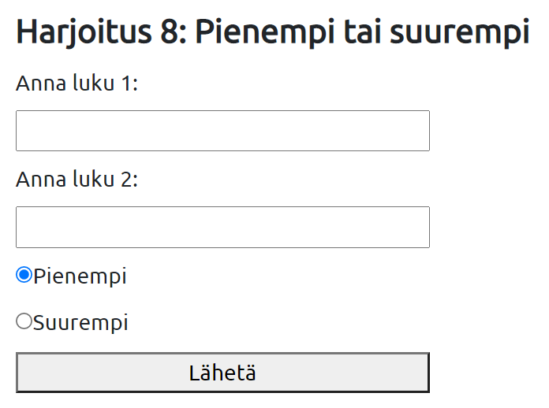

# Harjoitukset 2

**Ennen näitä harjoituksia tutustu osioihin parametrit sivustolla ja lomakkeet.**

Käytä *submit form*:ia parametrien välittämiseen ohjelmalle (saat ne superglobaalin muuttujan *$_GET* kautta).

Tee jokainen tehtävä omaan *.php*-tiedostoon ja tee palautussivusto, jonka yläpalkista pääsee selailemaan tehtäväsivujen välillä. Sijoita navigaatiopalkki kaikille tehtäville yhteiseen *header.php* tiedostoon, tee myös *footer.php*-tiedosto ja käytä näitä kaikissa tehtävissä. Muotoile jokainen sivu CSS:llä siistiksi.

Huom! Pyöristä arvot [ohje](https://www.php.net/manual/en/function.round.php).
Huom! Lisää hintoihin €-merkki tulostuksessa.

---

### Tehtävä 1

Laadi PHP:n avulla ohjelma, joka laskee ja tulostaa, montako litraa bensaa tietyllä rahamäärällä saa. Pyydä lomakkeen avulla käytössä oleva rahamäärä, voit olettaa bensan hinnaksi 1,97 euroa/litra. 

*Huom!* PHP käyttää desimaalipistettä pilkun sijaan.


Tulostus voisi näyttää esim. tältä:


---

### Tehtävä 2

Laadi ohjelma, joka pyytää lomakkeella syötteinä ostosten loppusumman ja asiakkaan antaman rahamäärän, ja laskee ja tulostaa, paljonko asiakas saa takaisin. Esimerkiksi jos maksat satasella alle satasen ostokset, paljonko saat takaisin. Jos rahat eivät riitäkään, ohjelma tulostaa "Anna lisää rahaa".


Tulostus voisi näyttää esim. tältä:


---
### Tehtävä 3

Laadi ohjelma, joka pyytää lomakkeella tuotteen hinnan ja arvonlisäveroprosentin, ja laskee sekä tulostaa arvonlisäveron euromäärän sekä verollisen hinnan.


Tulostus voisi näyttää esim. tältä:


---
### Tehtävä 4

Laadi ohjelma, joka pyytää lomakkeella syötteenä luvun väliltä 1 - 10.
Itse ohjelmassa arvo satunnaisluku väliltä 1 -10.
Jos luvut ovat samat, ohjelma tulostaa "onnittelut", muuten "tämä arpa ei voittanut". 


Tulostus voisi näyttää esim. tältä:


---
### Tehtävä 5

Laadi ohjelma, joka pyytää lomakkeella syötteenä viimeisen kokeen arvosanan (1 - 3).
Jos luku on 1, ohjelma tulostaa "Paranna hiukan". Jos luku on 2, ohjelma tulostaa "Ihan ok" ja jos luku on 3, ohjelma tulostaa "Hienoa". Jos luku ei ole mikään näistä, se pyytää antamaan luvun uudestaan.


Tulostus voisi näyttää esim. tältä:


---
### Tehtävä 6

Laadi ohjelma, joka pyytää lomakkeella työntekijän työtunnit, tuntipalkan sekä ennakonpidätyksen veroprosentin, ja laskee ja tulostaa bruttopalkan, veron määrän ja nettopalkan.


Tulostus voisi näyttää esim. tältä:


---
### Tehtävä 7

Laadi ohjelma, joka pyytää lomakkeella tuotteen yksikköhinnan ja tilatun määrän sekä alennusprosentin, ja laskee sekä tulostaa kokonaishinnan (ilman alennusta), alennuksen määrän sekä alennetun hinnan. Mikäli kokonaishinta ylittää 300 €, annetaan vielä 5 % lisäalennus, joka ilmoitetaan myös sivulla.


Tulostus voisi näyttää esim. tältä:


---
### Tehtävä 8

Laadi ohjelma, jossa käyttäjää pyydetään syöttämään kahteen lomakekenttään luvut ja radionapin avulla tiedon siitä, haluaako hän tulostettavaksi suuremman vai pienemmän luvun. Haluttu luku tulostetaan ruudulle.



Tulostus voisi näyttää esim. tältä:


*Vihje:*

Radionapit tehdään näin: 

```html
suurempi: <input type="radio" name="valinta" value="suurempi">
pienempi: <input type="radio" name="valinta" value="pienempi">
```

Valinnan lukeminen:
```php 
if($_POST["valinta"]=="pienempi")
```
Voit tehdä toisen valituksi kirjoittamalla:

```html
suurempi: <input type="radio" name="valinta" value="suurempi" checked="checked">
```
