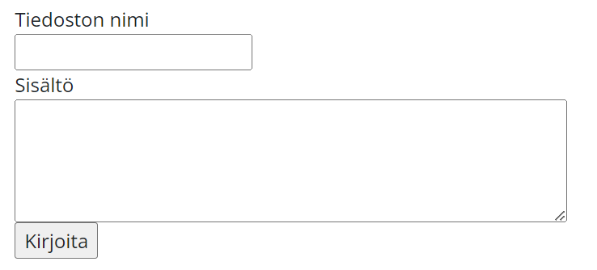

# Harjoitukset 7

Luo näille harjoituksille oma kansio nimeltään Harjoitukset 7 tai Assignments 7.

## 1. Tiedoston kirjoittaminen.

Luo sivu, jolla on lomake, jonka avulla voit lisätä erilliseen tiedostoon lomakkeen sisällön. Luo kansioosi oma kansio nimeltään temp, johon tiedostot tallentuvat. Lomakkeella on kaksi kenttää eli kenttä tiedoston nimelle sekä sisällölle sekä tallennusnappi. Tiedosto tallennetaan .txt-muodossa. Lomake saattaisi näyttää seuraavanlaiselta.



## 2. Rekisteröityminen

Olette tekemässä tapahtumalle sivustoa. Tapahtumaan tulijoiden täytyy rekisteröityä tapahtumaan etukäteen. Sivustolla on lomake, johon voi syöttää seuraavat tiedot:

- nimi
- sähköpostiosoite
- puhelinnumero
- yritys
- esittelyteksti
- onko henkilö esiintyjä, järjestäjä vai vierailija

Pakollisia tietoja ovat nimi, sähköpostiosoite, puhelinnumero ja onko henkilö esiintyjä, järjestäjä vai vierailija (radio).

Kun henkilö on täyttänyt tiedot, tulosta ne ensin ruudulle. Lisäksi esillä on teksti "Tarkistathan tietosi ja paina sitten "Lähetä" -nappia." Esiin tulee uusi nappi, jota painamalla tiedot kirjoitetaan tiedostoon, johon voi lisätä loputtoman määrän osallistujia. Tiedoston nimi on participants.txt.

## 3. Kuvagalleria

Tee sivu, jolla on lomake, joka ottaa vastaan vain kuvatiedostoja eikä samaa tiedostoa voi tallentaa useaan kertaan.

Kuvat tallennetaan images-nimiseen kansioon.

Luo sivulle sitten kuvagalleria ladatuista kuvista ja hoida muotoilu järkeväksi.

Kuvien saaminen näkyviin kansiosta vaatii tällaisen koodin:

````php
<?php
// Define the directory where your images are stored
$imageDirectory = 'images/';

// Get all files in the directory
$files = scandir($imageDirectory);

// Remove . and .. from the list
$files = array_diff($files, array('.', '..'));

// Loop through each file and display as an image
foreach ($files as $file) {
    // Check if it's an image file 
    if (in_array(pathinfo($file, PATHINFO_EXTENSION), array('jpg', 'jpeg', 'png', 'gif'))) {
        echo '';
    }
}
?>
````

## 4. Palautelomake

Suunnittele palautelomake jolla voidaan pyytää kotisivun kävijöiltä palautetta. Mieti mitä kenttiä palautelomakkeella voisi olla. Kun käyttäjä lähettää lomakkeen Lähetä palaute-painikkeella niin uusi palaute tallennetaan CSV-tiedostoon uudelle riville. CSV-tiedostossa jokainen kenttä on erotettu erotinmerkillä, käytä erotinmerkkinä ";".

PHP:ssa on näppärä fuktio [fputcsv](https://www.w3schools.com/php/func_filesystem_fputcsv.asp)<base target="_blank"> jolla voit luoda helposti CSV-tiedoston. Avaa tiedosto nyt Append-muodossa jotta uusi palaute ei tuhoa vanhoja tietoja.

[Lue lisää CSV-tiedostoista](https://fi.wikipedia.org/wiki/CSV)<base target="_blank">.