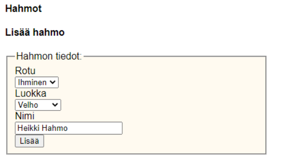

# Harjoitus 5

Tässä harjoituksessa teemme sivuston, jolle voi lisätä roolipelihahmoja sekä niitä varten hahmoluokkia ja pelattavia rotuja.

### Tietokanta

Laadi aluksi cPanelin tietokantaasi kolme taulua. Voit nimetä ne esimerkiksi classes, races ja characters. Lisää yhteydet taulujen välille.

Lisää relaatiot character-taululle relaationäkymässä (Relation view):

### Hahmoluokan lisääminen

Ensimmäinen toiminto on hahmoluokan lisääminen. Tee lomake joka lisää tauluun uuden tiedon. Näytä tämän jälkeen tietokantaan lisätyt luokat listassa. Lisää linkki tiedon poistamista varten jokaiselle tietueelle.

Näkymä voi näyttää suunnilleen tältä:

### Rotujen lisääminen

Lisää toiminto rotujen lisäämiselle ja poistamiselle. Näytä rodut taulukossa. Ulkoasu voi olla vastaava kuin hahmoluokissa.

### Hahmon luominen

Hahmon lisääminen vaatii lomakkeen jossa haetaan SELECT-ohjaimiin rodut ja luokat. Kannattaa ensimmäisenä pyytää käyttäjältä vain nimi, luokka ja rotu ja testata toimintaa tässä vaiheessa. Käyttäjä voi lisätä tiedot muille kentille (strength, agility ja wisdom) tai voit arpoa nämä automaattisesti. Se voi näyttää alkuun tältä:

### Hahmojen näyttäminen

Näytä tietokannan hahmot div-elementeissä. Mieti sopiva muotoilu. Kun haet hahmot niin hae myös luokan ja rodun nimi toisesta taulusta (JOIN).

### Hahmojen poistaminen ja muokkaaminen

Lisää toiminto hahmon muokkaamiselle ja poistamiselle. Muokkaaminen kannattaa tehdä omalle sivulle.

Kun näytät select-ohjaimessa tiedon tarvitset if/else-rakennetta. Valittu option saadaan selected-attribuutin avulla.

### Lisätehtävät

Lisää hahmonluontiin strength, agility ja wisdom niin, että hahmoa luodessa voi käyttää yhteensä 16 pistettä.

Lisää hahmoille kuvat. Käytännössä tietokantaan pitää lisätä URL, jossa kuva on.