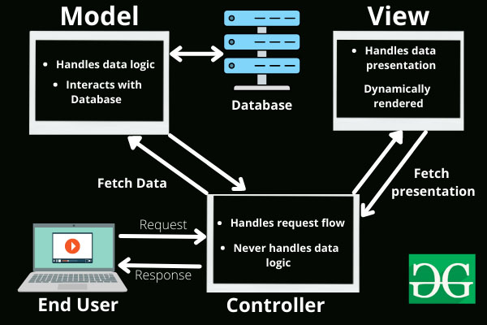

# MVC-malli

MVC-malli on ohjelmistoarkkitehtuurin käsite, jolla jaotellaan ohjelmistoa eri käytön mukaan eri tasoihin. MVC on lyhennelmä sanoista Model, View ja Controller eli malli, näkymä ja kontrolloija. Tämä malli on pohjana useimmissa moderneissa full stack -ohjelmistoissa eli sellaisissa ohjelmistoissa, joissa on käyttöliittymä eli front end, joka on näkyvä ohjelmiston osa, sekä back end, joka on loppukäyttäjälle näkymätön osa, joka käy keskustelua tietokannan kanssa ja käsittelee ja muokkaa tietoja.

MVC-malli koostuu yksinkertaisimmillaan kolmesta eri osiosta, mutta edistyneemmässä ohjelmistoarkkitehtuurissa osioita voi olla enemmänkin näiden lisäksi.

- Model

Model-osio pitää sisällään tietokantaan menevien olioiden mallit ja tietokantayhteydet.

- View

View-osio pitää sisällään verkkosivunäkymät, jotka tulevat käyttäjille selaimessa.

- Controller

Controller-osio käsittelee käyttäjän tietoja ja välittää niitä sekä View'lle että Model'ille. 

Tässä kaaviokuvana MVC-mallin osien toimintaa.

Me tutustumme yhteen esimerkkiin MVC-mallista [news-sivuston avulla](https://github.com/otredu/news_2021)<base target="_blank">.