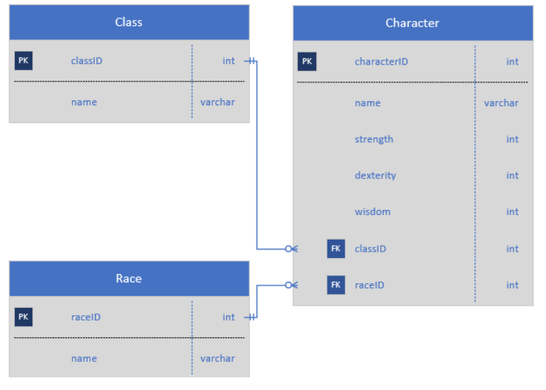
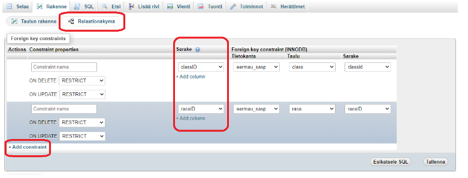
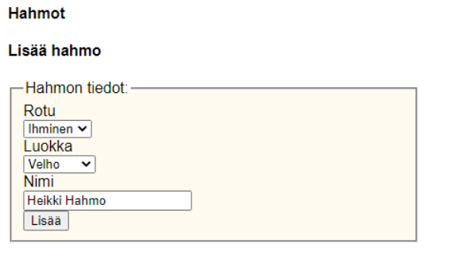

# Harjoitus 5

Tässä harjoituksessa teemme sivuston, jolle voi lisätä roolipelihahmoja sekä niitä varten hahmoluokkia ja pelattavia rotuja. Vaihtoehtoisesti voit käyttää Johdastus systeemityöhön -kurssilla tehtyä tietokantaa ja sen aihepiiriä, mutta tämän harjoituksen sivustolta pitää löytyä kaikki samat palaset.

### Tietokanta

Laadi aluksi cPanelin tietokantaasi kolme taulua. Voit nimetä ne esimerkiksi classes, races ja characters. Lisää yhteydet taulujen välille. Voit myös käyttää opettajan laatimaa [dumpia](dump.sql).



Lisää relaatiot character-taululle relaationäkymässä (Relation view):



### Hahmoluokan lisääminen

Ensimmäinen toiminto on hahmoluokan lisääminen. Tee lomake joka lisää tauluun uuden tiedon. Näytä tämän jälkeen tietokantaan lisätyt luokat listassa. Lisää linkki tiedon poistamista varten jokaiselle tietueelle.

Näkymä voi näyttää suunnilleen tältä:


### Rotujen lisääminen

Lisää toiminto rotujen lisäämiselle ja poistamiselle. Näytä rodut taulukossa. Ulkoasu voi olla vastaava kuin hahmoluokissa.

### Hahmon luominen

Hahmon lisääminen vaatii lomakkeen, jossa haetaan SELECT-ohjaimiin rodut ja luokat. Kannattaa ensimmäisenä pyytää käyttäjältä vain nimi, luokka ja rotu ja testata toimintaa tässä vaiheessa. Käyttäjä voi lisätä tiedot muille kentille (strength, dexterity ja wisdom) tai voit arpoa nämä automaattisesti. Se voi näyttää alkuun tältä:



### Hahmojen näyttäminen

Näytä tietokannan hahmot div-elementeissä. Mieti sopiva muotoilu. Kun haet hahmot niin hae myös luokan ja rodun nimi toisesta taulusta (JOIN).


### Hahmojen poistaminen ja muokkaaminen

Lisää toiminto hahmon muokkaamiselle ja poistamiselle. Muokkaaminen kannattaa tehdä omalle sivulle.

Kun näytät select-ohjaimessa tiedon tarvitset if/else-rakennetta. Valittu option saadaan selected-attribuutin avulla.

Hahmon perään voi laittaa linkit, joista muokkaaminen ja poistaminen onnistuvat. Ne voivat näyttää suunnilleen tältä:

````php
        <a id=<?=$characterid ?> onClick='confirmDelete(<?=$id?>)' href='/delete_character?id=<?=$id?>'>Poista hahmo</a> | 
        <a href='/update_character?id=<?=$id?>'>Päivitä hahmo</a>
````

### Lisätehtävät

Lisää hahmonluontiin strength, dexterity ja wisdom niin, että hahmoa luodessa voi käyttää yhteensä 16 pistettä. Käyttäjä näkee maksimipisteet ja niiden määrä pienenee, kun käyttäjä lisää pisteen johonkin ominaisuuksista.

Lisää hahmoille kuvat. Käytännössä tietokantaan pitää lisätä URL, jossa kuva on.

Lisää sekä rodulle että hahmoluokalle sellainen ominaisuus, että valinnat vaikuttavat hahmoon. Eli jokainen hahmoluokka ja rotu antaa yhden bonuspisteen strengthiin, dexterityyn tai wisdomiin. Tämä voidaan kysyä Selectillä rodun ja hahmoluokan luonnissa.

Lisää hahmolle vielä varusteet eli sillä on esimerkiksi armor ja weapon, joihin voi kirjoittaa haluamansa tekstin. Jos haluat oikeasti haastaa itseäsi, armor ja weapon ovat omia taulujaan, jolloin armorilla on jokin puolustuspistemäärä ja weaponilla on jokin hyökkäyspistemäärä. Näytä sitten hahmossa sen armor ja weapon ja niiden mahdolliset bonukset.