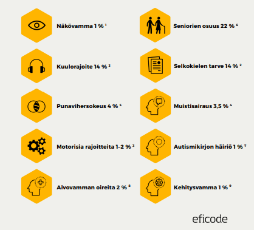

# Saavutettavuus

Saavutettavuus (accessibility) tarkoittaa sitä, että kaikki voivat käyttää verkkopalvelua riippumatta toimintarajoitteista, joita voivat aiheuttaa esimerkiksi erilaiset vammat tai korkea ikä.

Laki digitaalisten palveluiden tarjoamisesta velvoittaa merkittävän osan digitaalisista palveluista huolehtimaan saavutettavuudesta riittävällä tasolla. Tämä koskee tällä hetkellä ennen kaikkea julkisia palveluita, mutta on laajenemassa osin myös yksityisiin.

Arvioidaan, että 30-40 %:lla internetin käyttäjistä on joitakin käyttöön liittyviä rajoitteita. Siksi saavutettavuus koskee muun muassa seuraavia väestöryhmiä:
- ikääntyneet
- sokeat, heikkonäköiset, värisokeat ja ikänäköiset
- kuulovammaiset ja kuurot
- henkilöt, joilla on kognitiivisia rajoitteita, kuten oppimisen ja ymmärtämisen ongelmia, kielellisiä vaikeuksia, autismikirjon häiriöitä tai muistisairauksia
- henkilöitä, joilla on käsien motoriikan rajoitteita
- henkilöitä, jotka käyttävät vanhoja laitteita tai verkkoselaimia tai joilla on huono verkkoyhteys
- kokemattomat käyttäjät
- vain näppäimistön käyttäjät

Eficoden saavutettavuusoppaassa esitetään rajoitteisten henkilöiden määrä seuraavasti:


Erilaisia rajoitteita ja rajoitteellisia käyttäjiä on siis paljon. Lisäksi henkilöillä voi olla väliaikaisia rajoitteita, jolloin hyvin saavutettava palvelu voi auttaa myös heitä.

Aluehallintovirastolla on suomeksi saavutettavuusvaatimuksia listaava sivusto, jolla käydään läpi myös [WCAG 2.1 lain vaatimukset](https://www.saavutettavuusvaatimukset.fi/fi/digipalvelulain-vaatimukset/wcag-21-lain-vaatimukset)<base target="_blank">. Laissa todetaan, että kaikki A- ja AA-tason kriteerit tulee täyttää, AAA-tason kriteerit eivät ole pakollisia.

Alla käymme läpi osan yleisimmistä saavutettavuuteen liittyvistä asioista, jotka on hyvä käydä tässä vaiheessa läpi ja ottaa säännölliseen käyttöön. Osa liittyy enemmän sivuston ulkoasun ja suunnitteluun kuin varsinaiseen koodaamiseen.

## Kontrastit

Yksi saavutettavuuden kriteereitä on värikontrastit eli tekstin tulee erottua riittävän selkeästi taustasta. Kontrastia voi testata erilaisilla verkkopalveluilla, esimerkiksi [WebAIMin palvelulla](https://webaim.org/resources/contrastchecker/)<base target="_blank">. Se antaa vastaukseksi jonkin astearvon. Hyvä taso AA on lain mukaan 4.5:1, mutta siihen vaikuttaa muun muassa tekstin koko jne. Yllä oleva palvelu kertoo, riittääkö astearvo eri tilanteissa.

## Värien käyttö

Värit eivät koskaan saisi olla ainoa informaation antaja, sillä osa ihmisistä on värisokeita. Varsinkin pelkkä vihreä tai pelkkä punainen väri ovat ongelmallisia, sillä punavihervärisokeus on yleisin värisokeuden muoto. 

## Elementtien koko

Sekä tekstin että elementtien tulee olla riittävän suuria. Niiden pitää olla myös suurennettavissa. Nappien ja muiden interaktiivisten elementtien koon tulee olla suuri, jotta niihin on helppoa osua myös esimerkiksi tärisevin käsin.

## Käytettävyys ruudunlukijalla

Olemme käyneet jo aikaisemmin läpi sitä, että HTML-elementit nimetään semanttisesti oikein, jotta ruudunlukijat osaavat lukea ja käyttää niitä. Esimerkiksi ``<div>`` on käytännössä näkymätön ruudunlukijalle, joten vaikka se on mahdollista muotoilla näyttämään ja toimimaan kuin nappi, se on saavutettavuuden kannalta todella huono. Eli napin kuuluu olla joko ``<button>`` tai ``<input type="button">``. Sama koskee navigointia eli on tärkeää, että siinä on ``<nav>``, jonka sisällä on lista, jotta ruudunlukijat osaavat käyttää navigontia.

Semanttisten elementtien lisäksi on olemassa WAI-ARIA (Web Accessibility Initiative Accessible Rich Internet Applications), jota voi lisätä HTML-elementteihin antamaan lisätietoja kyseisestä elementistä. Ne eivät muuta HTML:n ulkonäköä tai toimivuutta, mutta voivat vaikuttaa ruudunlukijaan. Periaatteessa jos HTML-elementit on valittu semanttisesti oikein, WAI-ARIA-merkinnät ovat tarpeettomia. Semanttiset elementit kehitettiin suunnilleen yhtä aikaa WAI-ARIAn kanssa. Niillä voi kuitenkin joskus selkeyttää jotain elementtiä, kun visuaaliset vihjeet ovat pois käytöstä. 

````html
<a aria-label="Read more about some awesome article title">Read More</a>
````

Esimerkissä oletetaan, että jokin ulkoasussa ilmaisee, että tämä on erityisen kiinnostava artikkeli.

Käykää tutustumassa WAI-ARIAn perusteisiin [täällä](https://web.dev/learn/accessibility/aria-html?continue=https%3A%2F%2Fweb.dev%2Flearn%2Faccessibility%23article-https%3A%2F%2Fweb.dev%2Flearn%2Faccessibility%2Faria-html)<base target="_blank">.

## Kuvat

Kuvilla kuuluu olla aina koodissa kuvausteksti eli *alt*. Ruudunlukija lukee sen käyttäjälle. Siksi kannattaa panostaa *alt*-tekstiin sen mukaisesti, kuinka tärkeä kuva on. Jos se on merkityksetön kuvituskuva, hyvä *alt* on ihan vain *Kuvituskuva*. Tai vaihtoehtoisesti se voi olla *""* eli tyhjä, mikä ei siis ole sama kuin puuttuva. Kuvituskuvan voi myös piilottaa ruudunlukijalta seuraavilla tavoilla WAI-ARIAlla: 

````html
<!-- All of these choices lead to the same result. -->


````
## Lomakkeet

Lomakkeet ovat jossakin määrin haastavia saavutettavuuden suhteen. Niiden käytettävyys paranee, kun esimerkiksi ``<input>``-elementeille annetaan oikea tyyppi, jolloin vääränlaisia syötteitä on vaikeampi antaa. On myös suositeltavaa antaa jokaiselle ``<input>``-elementille selkeästi ``<label>``, joka on oikeaoppisesti yhdistetty joko käyttämällä *id*tä tai yhdistämällä ``<input>`` ``<label>``in sisään, kuten esimerkissä.

````html 
<form id="sundae-order-form">
  <p><label>Name (required): <input type="name" autocomplete="name" required></label></p>
  <p><label>Telephone (required): <input type="tel" autocomplete="tel" required></label></p>
  <p><label>Email address: <input type="email" autocomplete="email"></label></p>
</form>
````

## Demoharjoitus 1

1. Testaa verkkosivua värisokeusfilttereillä
- Käy opettajan laatimalla testisivulla osoitteessa [https://treduan.github.io/colorblindness-test/](https://treduan.github.io/colorblindness-test/)<base target="_blank"> ja käytä siihen Chrome-selainta.
- Lataa Chrome-selaimeen lisäosa nimeltään Colorblindness Emulator.
- Opettajan sivuston kuusi ensimmäistä laatikkoa ovat puna-vihreitä. Katso, miltä ne näyttävät erilaisien värisokeusfilttreiden läpi.
- Katso myös, miltä alla olevat kuvat näyttävät eri filttereillä.

2. Testaa värikontrasteja
- Avaa kehittäjätyökalut opettajan sivulla ja etsi sieltä Elements-osa. Sieltä voit katsoa neliöiden taustavärit ja tekstivärit. Valitse kolme neliötä, joiden kontrastit tarkistat [WebAIMin palvelulla](https://webaim.org/resources/contrastchecker/)<base target="_blank">. Jos kontrasti ei ole riittävä vähintään AA-tasoon, testaa, millainen väriyhdistelmä läpäisee testin. Voit myös testata vaihtaa värit sivulla ja nähdä käytännön lopputuloksen.

## Demoharjoitus 2
1. Asenna Chrome-selaimeesi lisäosa nimeltään Wave.
2. Käytä opettajan sivustolla Wavea. Mene katsomaan Details-välilehteä. Mitä kaikkea Wave kertoo verkkosivun saavutettavuudesta?