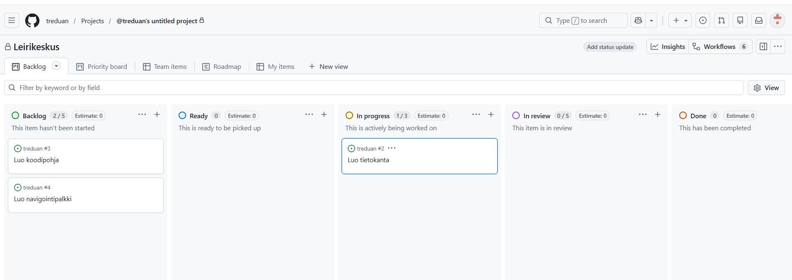

# Projektiseinä (Project Board/Kanban)

## Mikä on projektiseinä?

Projektiseinä on työkalu, jolla seurataan projektin etenemistä.

Se näyttää:
- mitä pitää tehdä
- mitä tehdään parhaillaan
- mitä on jo tehty

Projektiseinä tekee työstä **näkyvää koko tiimille**.

---

## Miksi projektiseinää käytetään?

Ilman projektiseinää:
- kukaan ei tiedä, kuka tekee mitä
- tehtäviä unohtuu
- sama asia voidaan tehdä kahdesti

Projektiseinä auttaa:
- jakamaan työtä
- seuraamaan etenemistä
- pitämään projektin hallinnassa

---

## Projektiseinän perusrakenne

Yleensä projektiseinässä on vähintään kolme saraketta:

### To Do
- tehtävät, joita ei ole vielä aloitettu

### In Progress
- tehtävät, joita tehdään parhaillaan

### Done
- valmiit tehtävät

Tehtävät siirtyvät vasemmalta oikealle projektin edetessä.

Oletuksena GitHubin projektiseinällä on viisi saraketta: Backlog, Ready, In progress, In review ja Done. Näitä on mahdollista muokata.

- Backlogiin laaditaan kaikki projektin taskit. 
- Readyyn laitetaan ne, jotka joku voi valita itselleen. 
- In progressiin siirretään ne, jotka joku on ottanut omiksi tehtävikseen. 
- In reviewssä ovat sellaiset taskit, jotka on tehty, mutta jotka joku toinen testaa tai muuten tarkistaa. 
- Doneen laitetaan valmiit ja testatut taskit.

---

## Mitä projektiseinälle laitetaan?

Projektiseinällä on **taskeja (tehtäviä)**.

Taski on:
- pieni ja selkeä tehtävä
- jotain, jonka yksi henkilö voi tehdä

---

## Esimerkki taskeista

Projektista riippuen tehtävät voivat olla esimerkiksi:

- luo tapahtumalistaus
- lisää nappi ilmoittautumiseen
- näytä lisätiedot klikkauksella
- lisää viesti “tapahtuma täynnä”

Taskit tulevat usein **user storyista**.

---

## Hyvän taskin ominaisuudet

Hyvä taski on:

- selkeä (mitä tehdään?)
- riittävän pieni
- toteutettavissa ilman lisäselvitystä

Huono:
- “tee käyttöliittymä”

Parempi:
- “luo lista tapahtumista sivulle”

---

## Miten projektiseinää käytetään?

### 1. Lisää taskit To Do -sarakkeeseen
- kaikki tehtävät näkyville alussa

### 2. Ota tehtävä työn alle
- siirrä taski kohtaan **In Progress**

Yksi henkilö = yksi tehtävä kerrallaan (suositus)

### 3. Kun tehtävä valmis
- siirrä taski kohtaan **Done**

---

## Tärkeä sääntö

Projektiseinän pitää vastata todellisuutta.

- Älä pidä tehtävää To Do:ssa, jos olet aloittanut sen  
- Älä merkitse tehtävää valmiiksi, jos se ei ole oikeasti valmis  

---

## Definition of Done (milloin tehtävä on valmis?)

**Definition of Done** tarkoittaa yhteistä sopimusta siitä, **milloin task voidaan merkitä valmiiksi**.

Ilman tätä eri ihmiset voivat ajatella “valmiin” eri tavalla.

### Esimerkki

Onko tehtävä valmis, jos:
- koodi on kirjoitettu?  
- vai vasta kun se toimii selaimessa?  
- vai kun se on testattu?  

Definition of Done vastaa tähän.

---

### Esimerkki Definition of Done -listasta

Tehtävä on valmis, kun:
- toiminnallisuus toimii  
- se on testattu  
- koodi on lisätty GitHubiin  
- se näkyy käyttöliittymässä oikein  
- koodi on mergetty muuhun koodipohjaan (tätä käydään myöhemmin läpi)

---

### Miksi tämä on tärkeää?

- estää keskeneräisten tehtävien merkitsemisen valmiiksi  
- tekee työn laadusta tasaisempaa  
- helpottaa tiimityötä  

Kaikki tietävät, milloin työ oikeasti on valmis.

## GitHubin projektiseinä

Käytämme **GitHub**-palvelun projektiseinää.

Siellä:
- taskit ovat **issueita**
- niitä voi siirtää sarakkeesta toiseen
- ne voi yhdistää suoraan koodiin

Etu:
- koodi ja projektinhallinta samassa paikassa

---

## Muita yleisiä työkaluja

- **Trello**  
  - helppo ja visuaalinen  

- **Jira**  
  - käytössä monissa yrityksissä  

- **Asana**  
  - monipuolinen projektinhallintaan  

👉 Periaate on sama kaikissa:  
**tehtävät liikkuvat vaiheesta toiseen**

---

## Yleisimmät virheet

- tehtäviä ei pilkota tarpeeksi pieniksi  
- tehtäviä ei päivitetä  
- kaikki tekevät samaa taskia  
- projektiseinää ei käytetä aktiivisesti  

---

## Harjoitustehtävä

1. Yksi tiimistä luo projektille GitHub-repon ja sitten projektiseinän ja kutsuu muut tiimin jäsenet mukaan 
2. Lisätkää vähintään 5–10 taskia  
3. Jakakaa ensimmäiset tehtävät tiimin kesken. Jokaiselle tulee siis aluksi vain yksi task.  
