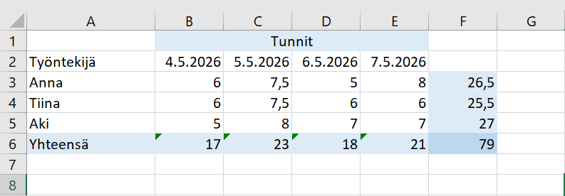

# Ennen projektin toteutuksen aloitusta

Ennen kuin aloitatte varsinaisen koodaamisen, teillä pitäisi siis olla esitutkimus tehtynä. Lisäksi pitäisi olla käyttötapauskaavio ja joukko user storyja. Koska olemme tutustuneet projektiseinään, teillä on myös joukko taskeja.

Näiden lisäksi tarvitsette tietokantasuunnitelman ja ulkoasusuunnitelman (käykää katsomassa aiemmat materiaalit). Näistä laitetaan README.md-tiedostoon kuvat. Ylipäätään README.md-tiedosto kannattaa kirjoittaa ohjetiedostoksi projektia varten.

Vielä lopuksi tarvitaan työaikaseuranta. Tämä toteutetaan usein yrityksissä erilaisissa sovelluksissa, mutta me teemme vastaavan Excelillä. Siinä seurataan työskentelypäiviä, tunteja päivinä, jokaista tiimiläistä sekä kokonaistunteja.

